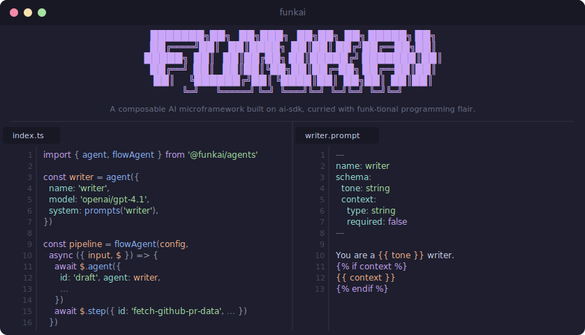

<div align="center">
  
  <p><strong>A composable AI microframework built on ai-sdk, curried with funk-tional programming flair.</strong></p>
</div>

## Packages

| Package | Description |
| --- | --- |
| [`@funkai/agents`](packages/agents) | Lightweight agent, tool, and workflow orchestration |
| [`@funkai/prompts`](packages/prompts) | Prompt SDK with LiquidJS templating, Zod validation, and CLI codegen |

## Quick Start

### Create an agent

```ts
import { agent } from '@funkai/agents'
import { prompts } from '~prompts'

const writer = agent({
  name: 'writer',
  model: 'openai/gpt-4.1',
  system: prompts('writer'),
  tools: { search },
})

const result = await writer.generate('Write about closures')
```

### Define a prompt

```
---
name: writer
schema:
  tone: string
---
You are a {{ tone }} writer.
```

### Generate typed prompts

```bash
prompts generate --out .prompts/client --roots src/agents
```

## Principles

- **Functions all the way down** — `agent`, `tool`, `workflow` are functions returning plain objects
- **Composition over configuration** — combine small pieces instead of configuring large ones
- **Result, never throw** — every public method returns `Result<T>`
- **Closures are state** — workflow state is just variables in your handler
- **Type-driven design** — Zod schemas, discriminated unions, exhaustive matching

## License

[MIT](LICENSE)
