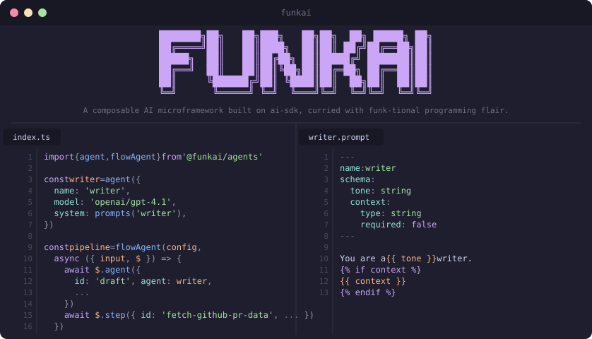

<div align="center">
  
  <p><strong>A composable AI microframework built on <a href="https://github.com/vercel/ai">ai-sdk</a>, curried with funk-tional programming flair.</strong></p>

<a href="https://github.com/joggrdocs/funkai/actions/workflows/ci.yml"></a>
<a href="https://www.npmjs.com/package/@funkai/agents"></a>
<a href="https://github.com/joggrdocs/funkai/blob/main/LICENSE"></a>

</div>

## Features

- :zap: **Functions all the way down** — `agent`, `tool`, `flowAgent` are functions returning plain objects.
- :jigsaw: **Composition over configuration** — Combine small pieces instead of configuring large ones.
- :shield: **Result, never throw** — Every public method returns `Result<T>`.
- :lock: **Closures are state** — Flow agent state is just variables in your handler.
- :triangular_ruler: **Type-driven design** — Zod schemas, discriminated unions, exhaustive matching.

## Why funkai

The [Vercel AI SDK](https://sdk.vercel.ai) is an excellent foundation for working with LLMs. funkai doesn't replace it — it's a thin, opinionated layer on top that adds functional agent composition, a prompt SDK with templating and codegen, model cost tracking, and Result-based error handling. If you're already using `ai` and want structured workflows without leaving the ecosystem, funkai fills those gaps.

> [!TIP]
> Looking for a batteries-included agent framework? Check out **[VoltAgent](https://voltagent.dev)** — a full-featured runtime with built-in observability, tool ecosystem, and everything you need out of the box. We recommend it highly, and funkai may build on top of it in the future.

For a deeper comparison with alternatives, see [Why funkai](docs/why-funkai.md).

## Install

```bash
npm install @funkai/agents @funkai/prompts
```

## Usage

### Create an agent

```ts
import { agent } from "@funkai/agents";
import { openai } from "@ai-sdk/openai";

const writer = agent({
  name: "writer",
  model: openai("gpt-4.1"),
  system: "You are a helpful writer.",
  tools: { search },
});

const result = await writer.generate({ prompt: "Write about closures" });
```

### Define a prompt

```
---
name: writer
schema:
  tone: string
---
You are a {{ tone }} writer.
```

### Generate typed prompts

```bash
npx funkai prompts generate --out .prompts/client --includes "src/agents/**"
```

## Packages

| Package                               | Description                                                          |
| ------------------------------------- | -------------------------------------------------------------------- |
| [`@funkai/agents`](packages/agents)   | Lightweight agent, tool, and flow agent orchestration                |
| [`@funkai/models`](packages/models)   | Model catalog, provider resolution, and cost calculations            |
| [`@funkai/prompts`](packages/prompts) | Prompt SDK with LiquidJS templating, Zod validation, and CLI codegen |
| [`@funkai/cli`](packages/cli)         | CLI for the funkai prompt SDK                                        |

## License

[MIT](LICENSE)
