# Architecture

High-level overview of how funkai is structured, its design philosophy, and how data flows through the system.

## Overview

funkai is an AI SDK framework built on top of the Vercel AI SDK. It provides lightweight workflow and agent orchestration (`@funkai/agents`) and a prompt authoring SDK with LiquidJS templating and Zod validation (`@funkai/prompts`).

The codebase follows a functional, immutable, composition-first design. There are no classes (except when wrapping external SDK instances), no `any`, and side effects are pushed to the edges. Prefer returning errors as values using `attempt()` from es-toolkit and Result tuples.

## Package Ecosystem

```
packages/
├── agents/          # @funkai/agents -- Workflow and agent orchestration
└── prompts/         # @funkai/prompts -- Prompt SDK with templating and validation
```

| Package           | Purpose                                                         |
| ----------------- | --------------------------------------------------------------- |
| `@funkai/agents`  | Agent and workflow orchestration: agents, workflows, steps, tools, hooks, provider |
| `@funkai/prompts` | Prompt authoring SDK: LiquidJS templating, Zod validation, CLI, codegen |

## Agents Package

The agents package provides primitives for building AI agent workflows.

### Core Primitives

| Primitive  | Purpose                                                        |
| ---------- | -------------------------------------------------------------- |
| Agent      | Autonomous AI entity with tools, model, and system prompt      |
| Workflow   | Multi-step orchestration of agents and operations              |
| Step (`$`) | Builder for defining individual workflow steps                 |
| Tool       | Typed function that agents can call during execution           |
| Hook       | Lifecycle callbacks for workflows and agents                   |
| Provider   | Model provider configuration (OpenRouter + Vercel AI SDK)      |

### Data Flow

```mermaid
%%{init: {
  'theme': 'base',
  'themeVariables': {
    'primaryColor': '#313244',
    'primaryTextColor': '#cdd6f4',
    'primaryBorderColor': '#6c7086',
    'lineColor': '#89b4fa',
    'secondaryColor': '#45475a',
    'tertiaryColor': '#1e1e2e',
    'actorBkg': '#313244',
    'actorBorder': '#89b4fa',
    'actorTextColor': '#cdd6f4',
    'signalColor': '#cdd6f4',
    'signalTextColor': '#cdd6f4'
  }
}}%%
sequenceDiagram
    participant U as User
    participant W as Workflow
    participant S as Step
    participant A as Agent
    participant T as Tool
    participant P as Provider

    rect rgb(49, 50, 68)
        Note over U,W: Setup
        U->>W: Define workflow with steps
        W->>S: Build step configuration
    end

    rect rgb(49, 50, 68)
        Note over W,T: Execute
        W->>S: Run next step
        S->>A: Execute agent
        A->>P: Generate with model
        P-->>A: Model response
        A->>T: Call tool (if needed)
        T-->>A: Tool result
        A-->>S: Step result
        S-->>W: Continue to next step
    end

    rect rgb(49, 50, 68)
        Note over W,U: Complete
        W-->>U: Workflow output
    end
```



## Prompts Package

The prompts package provides a prompt authoring SDK with two surfaces:

### Dual Surface

| Surface | Purpose                                                    |
| ------- | ---------------------------------------------------------- |
| CLI     | Author, validate, and manage prompt files from the terminal |
| Library | Runtime API for loading, rendering, and validating prompts  |

### Key Concepts

| Concept      | Purpose                                              |
| ------------ | ---------------------------------------------------- |
| Frontmatter  | YAML metadata (model, temperature, variables schema) |
| Template     | LiquidJS template body with variable interpolation   |
| Partial      | Reusable template fragment included via `` |
| Codegen      | Generate TypeScript types from prompt files           |

## Design Decisions

1. **Functional by default** -- Factory functions, closures, and plain objects instead of classes
2. **Immutable data** -- Use `readonly`, `as const`, spread/destructuring; no in-place mutation
3. **Expression over statement** -- Return values from functions; use `match()`, `attempt()`, ternaries
4. **Type-driven** -- Discriminated unions, branded types, exhaustive matching via ts-pattern
5. **Zod at boundaries** -- Runtime validation for configs, user input, and external data
6. **Vercel AI SDK foundation** -- Built on `ai` package for model interaction, tool calling, and streaming
7. **OpenRouter provider** -- Default model routing through OpenRouter for multi-provider access
8. **Composition over inheritance** -- Small, focused interfaces composed together

## Package Conventions

All packages in this monorepo follow strict conventions to ensure consistency, type safety, and modern JavaScript practices.

### Module System

**ESM Only:**

- All packages use `"type": "module"` in `package.json`
- No CommonJS (`require`, `module.exports`)
- All imports use ESM syntax (`import`/`export`)

### Build Configuration

**tsdown:**

- All packages built with [tsdown](https://tsdown.dev)
- Generates `.mjs` files and `.d.mts` declaration files
- Tree-shakeable by default

### TypeScript Configuration

**Strict Mode:**

- `strict: true` -- All strict checks enabled
- `moduleResolution: bundler` -- Optimized for bundlers (tsdown)
- TypeScript 5.9 with latest type features

### Test Structure

**Vitest:**

- Unit tests colocated in `src/**/*.test.ts` alongside source files
- Run with `pnpm test --filter=@funkai/<package>`
- Coverage via `@vitest/coverage-v8`

### Package Naming

**Convention:**

- Scope: `@funkai/`
- Name: Lowercase, single word or hyphenated (e.g., `@funkai/agents`, `@funkai/prompts`)

### Package Structure

**Standard Layout:**

```
packages/{name}/
├── src/                  # Source files (.ts)
├── dist/                 # Build output (.mjs, .d.mts) [gitignored]
├── docs/                 # Package documentation
├── package.json          # Package manifest
├── tsconfig.json         # TypeScript config
├── tsdown.config.ts      # Build config
└── README.md             # Package docs
```

## References

- [Tech Stack](./tech-stack.md)
- [Coding Style](../standards/typescript/coding-style.md)
- [Design Patterns](../standards/typescript/design-patterns.md)
- [Errors](../standards/typescript/errors.md)
