# Custom Steps

`createFlowEngine()` builds a custom flow agent factory with additional step types merged into `$` and/or engine-level default hooks. Custom steps receive an `ExecutionContext` for cancellation and logging, and are fully typed on the handler's `$` parameter.

## Architecture

```mermaid
%%{init: {
  'theme': 'base',
  'themeVariables': {
    'primaryColor': '#313244',
    'primaryTextColor': '#cdd6f4',
    'primaryBorderColor': '#6c7086',
    'lineColor': '#89b4fa',
    'secondaryColor': '#45475a',
    'tertiaryColor': '#1e1e2e',
    'background': '#1e1e2e',
    'mainBkg': '#313244',
    'clusterBkg': '#1e1e2e',
    'clusterBorder': '#45475a'
  },
  'flowchart': { 'curve': 'basis', 'padding': 15 }
}}%%
flowchart LR
    subgraph engine ["createFlowEngine()"]
        CS(["Custom Steps ($)"])
        DH(["Default Hooks"])
    end

    engine --> FF(["FlowFactory"])
    FF --> FA1(["Flow Agent A"])
    FF --> FA2(["Flow Agent B"])

    classDef core fill:#313244,stroke:#89b4fa,stroke-width:2px,color:#cdd6f4
    classDef gateway fill:#313244,stroke:#fab387,stroke-width:2px,color:#cdd6f4
    classDef agent fill:#313244,stroke:#a6e3a1,stroke-width:2px,color:#cdd6f4

    class CS,DH gateway
    class FF core
    class FA1,FA2 agent

    style engine fill:#181825,stroke:#fab387,stroke-width:2px
```



The engine returns a `FlowFactory` -- a function with the same signature as `flowAgent()` but with custom steps and hooks baked in. All flow agents created from the factory share the custom `$` methods and engine-level hooks.

## Key Concepts

### CustomStepFactory

The type for a custom step implementation. Receives execution context and user-provided config, returns a result:

```ts
type CustomStepFactory<TConfig, TResult> = (params: {
  ctx: ExecutionContext;
  config: TConfig;
}) => Promise<TResult>;
```

| Param    | Type               | Description                                        |
| -------- | ------------------ | -------------------------------------------------- |
| `ctx`    | `ExecutionContext` | Provides `signal` (AbortSignal) and `log` (Logger) |
| `config` | `TConfig`          | The config object passed by the user               |

### FlowEngineConfig

Configuration for `createFlowEngine()`:

| Field          | Type                    | Description                                      |
| -------------- | ----------------------- | ------------------------------------------------ |
| `$`            | `CustomStepDefinitions` | Custom step types to add to `$`                  |
| `onStart`      | hook                    | Default hook: fires when any flow agent starts   |
| `onFinish`     | hook                    | Default hook: fires when any flow agent finishes |
| `onError`      | hook                    | Default hook: fires when any flow agent errors   |
| `onStepStart`  | hook                    | Default hook: fires when any step starts         |
| `onStepFinish` | hook                    | Default hook: fires when any step finishes       |

### Reserved Names

Custom steps cannot shadow built-in `StepBuilder` methods. The following names are reserved and will throw at engine creation time:

`step`, `agent`, `map`, `each`, `reduce`, `while`, `all`, `race`

### Hook Merging

Engine-level hooks merge with flow agent-level hooks. Both fire sequentially -- engine hooks first, then flow agent hooks. Each hook is independently error-swallowed so one failure does not prevent others from running.

## Usage

### Basic Custom Step

```ts
const engine = createFlowEngine({
  $: {
    fetch: async ({ ctx, config }) => {
      const response = await fetch(config.url, { signal: ctx.signal });
      ctx.log.info("Fetched URL", { url: config.url });
      return response.json();
    },
  },
});

const pipeline = engine(
  {
    name: "data-pipeline",
    input: z.object({ endpoint: z.string() }),
    output: z.object({ data: z.unknown() }),
  },
  async ({ input, $ }) => {
    const data = await $.fetch({ url: input.endpoint });
    return { data };
  },
);
```

### Retry Step

```ts
const engine = createFlowEngine({
  $: {
    retry: async ({ ctx, config }) => {
      let lastError: Error | undefined;
      for (let attempt = 0; attempt < config.attempts; attempt++) {
        if (ctx.signal.aborted) throw new Error("Aborted");
        try {
          return await config.execute({ attempt });
        } catch (err) {
          lastError = err as Error;
          ctx.log.warn("Retry attempt failed", { attempt, error: lastError.message });
        }
      }
      throw lastError;
    },
  },
});

const flow = engine(
  {
    name: "resilient-flow",
    input: z.object({ query: z.string() }),
    output: z.object({ answer: z.string() }),
  },
  async ({ input, $ }) => {
    const result = await $.retry({
      attempts: 3,
      execute: async ({ attempt }) => {
        const res = await $.agent({
          id: `generate-${attempt}`,
          agent: writer,
          input: input.query,
        });
        if (!res.ok) throw new Error(res.error.message);
        return res.value.output;
      },
    });
    return { answer: result };
  },
);
```

### Timeout Step

```ts
const engine = createFlowEngine({
  $: {
    timeout: async ({ ctx, config }) => {
      const controller = new AbortController();
      const timer = setTimeout(() => controller.abort(), config.ms);

      ctx.signal.addEventListener("abort", () => controller.abort());

      try {
        return await config.execute({ signal: controller.signal });
      } finally {
        clearTimeout(timer);
      }
    },
  },
});
```

### Engine-Level Hooks

Attach telemetry or logging at the engine level so all flow agents created from the factory share the same hooks:

```ts
const engine = createFlowEngine({
  onStart: ({ input }) => {
    telemetry.trackStart(input);
  },
  onFinish: ({ input, result, duration }) => {
    telemetry.trackFinish({ input, duration });
  },
  onError: ({ error }) => {
    errorReporter.capture(error);
  },
  onStepStart: ({ step }) => {
    telemetry.trackStepStart(step.id, step.type);
  },
  onStepFinish: ({ step, duration }) => {
    telemetry.trackStepFinish(step.id, duration);
  },
});
```

### Combining Custom Steps and Hooks

```ts
const engine = createFlowEngine({
  $: {
    retry: async ({ ctx, config }) => {
      let lastError: Error | undefined;
      for (let attempt = 0; attempt < config.attempts; attempt++) {
        try {
          return await config.execute({ attempt });
        } catch (err) {
          lastError = err as Error;
          ctx.log.warn("Retry failed", { attempt });
        }
      }
      throw lastError;
    },
    validate: async ({ config }) => {
      const parsed = config.schema.safeParse(config.data);
      if (!parsed.success) throw new Error(parsed.error.message);
      return parsed.data;
    },
  },
  onStart: ({ input }) => metrics.increment("flow.started"),
  onFinish: ({ duration }) => metrics.histogram("flow.duration", duration),
});
```

## References

- [Core Overview](../core/overview.md)
- [Context](../core/context.md)
- [Step Builder ($)](../core/step.md)
- [Hooks](../core/hooks.md)
