# Streaming

Streaming lets consumers process generation output incrementally as it arrives, rather than waiting for completion. Both `Agent` and `FlowAgent` support streaming via `.stream()`, returning a `StreamResult` with a live `fullStream` of typed events.

## Architecture

```mermaid
%%{init: {
  'theme': 'base',
  'themeVariables': {
    'primaryColor': '#313244',
    'primaryTextColor': '#cdd6f4',
    'primaryBorderColor': '#6c7086',
    'lineColor': '#89b4fa',
    'secondaryColor': '#45475a',
    'tertiaryColor': '#1e1e2e',
    'actorBkg': '#313244',
    'actorBorder': '#89b4fa',
    'actorTextColor': '#cdd6f4',
    'signalColor': '#cdd6f4',
    'signalTextColor': '#cdd6f4'
  }
}}%%
sequenceDiagram
    participant C as Consumer
    participant A as Agent
    participant M as Model

    C->>A: agent.stream(input)
    A-->>C: Result<StreamResult>

    rect rgb(49, 50, 68)
        Note over C,M: Stream consumption
        M-->>A: text-delta
        A-->>C: StreamPart (text-delta)
        M-->>A: tool-call
        A-->>C: StreamPart (tool-call)
        M-->>A: tool-result
        A-->>C: StreamPart (tool-result)
        M-->>A: finish
        A-->>C: StreamPart (finish)
    end

    C->>C: await result.output
    C->>C: await result.messages
```



## Key Concepts

### StreamResult

Returned by `.stream()` inside a `Result` wrapper. The `fullStream` is available immediately; other fields are promises that resolve after the stream completes.

```ts
interface StreamResult<TOutput = string> {
  output: Promise<TOutput>;
  messages: Promise<Message[]>;
  usage: Promise<TokenUsage>;
  finishReason: Promise<string>;
  fullStream: AsyncIterableStream<StreamPart>;
}
```

| Field          | Type                              | When Available         |
| -------------- | --------------------------------- | ---------------------- |
| `fullStream`   | `AsyncIterableStream<StreamPart>` | Immediately            |
| `output`       | `Promise<TOutput>`                | After stream completes |
| `messages`     | `Promise<Message[]>`              | After stream completes |
| `usage`        | `Promise<TokenUsage>`             | After stream completes |
| `finishReason` | `Promise<string>`                 | After stream completes |

### StreamPart Events

The `fullStream` emits `StreamPart` events -- a discriminated union from the AI SDK (`TextStreamPart<ToolSet>`). Use `part.type` to discriminate:

| `type`          | Description                | Key Fields              |
| --------------- | -------------------------- | ----------------------- |
| `"text-delta"`  | Incremental text output    | `textDelta: string`     |
| `"tool-call"`   | Model invoked a tool       | `toolName`, `args`      |
| `"tool-result"` | Tool execution completed   | `toolName`, `result`    |
| `"step-finish"` | A tool-loop step completed | `usage`, `finishReason` |
| `"finish"`      | Generation completed       | `usage`, `finishReason` |
| `"error"`       | An error occurred          | `error`                 |

### Dual Consumption

`AsyncIterableStream` supports both `for await...of` and `.getReader()`:

```ts
// AsyncIterable
for await (const part of result.fullStream) {
  // handle part
}

// ReadableStream
const reader = result.fullStream.getReader();
while (true) {
  const { done, value } = await reader.read();
  if (done) break;
  // handle value
}
```

## Usage

### Basic Streaming

```ts
const result = await myAgent.stream("Tell me a story");

if (!result.ok) {
  console.error(result.error.message);
  return;
}

for await (const part of result.fullStream) {
  if (part.type === "text-delta") {
    process.stdout.write(part.textDelta);
  }
}

const finalOutput = await result.output;
```

### Handling Multiple Event Types

```ts
import { match } from "ts-pattern";

const result = await myAgent.stream("Search and summarize");
if (!result.ok) return;

for await (const part of result.fullStream) {
  match(part)
    .with({ type: "text-delta" }, (p) => {
      process.stdout.write(p.textDelta);
    })
    .with({ type: "tool-call" }, (p) => {
      console.log(`Calling tool: ${p.toolName}`);
    })
    .with({ type: "tool-result" }, (p) => {
      console.log(`Tool ${p.toolName} returned result`);
    })
    .with({ type: "error" }, (p) => {
      console.error("Stream error:", p.error);
    })
    .otherwise(() => {});
}
```

### Streaming with Flow Agents

Flow agents support streaming via `$.agent()` with `stream: true`. When the flow agent itself is invoked via `.stream()`, agent steps configured with `stream: true` pipe their text output through the parent flow's stream:

```ts
const pipeline = flowAgent(
  {
    name: "content-pipeline",
    input: z.object({ topic: z.string() }),
    output: z.object({ article: z.string() }),
  },
  async ({ input, $ }) => {
    const research = await $.agent({
      id: "research",
      agent: researcher,
      input: input.topic,
      stream: true,
    });

    if (!research.ok) throw new Error("Research failed");

    return { article: research.value.output };
  },
);

const result = await pipeline.stream({ topic: "TypeScript patterns" });
if (result.ok) {
  for await (const part of result.fullStream) {
    if (part.type === "text-delta") {
      process.stdout.write(part.textDelta);
    }
  }
}
```

### Error Handling

Errors in the stream can appear as `StreamPart` events or as rejected promises on the result fields:

```ts
const result = await myAgent.stream("Generate content");
if (!result.ok) {
  console.error("Failed to start stream:", result.error.message);
  return;
}

try {
  for await (const part of result.fullStream) {
    if (part.type === "error") {
      console.error("Stream error:", part.error);
    }
    if (part.type === "text-delta") {
      process.stdout.write(part.textDelta);
    }
  }
} catch (err) {
  console.error("Stream iteration failed:", err);
}
```

### Cancellation

Pass an `AbortSignal` to cancel streaming:

```ts
const controller = new AbortController();

const result = await myAgent.stream("Long generation", {
  signal: controller.signal,
});

if (result.ok) {
  setTimeout(() => controller.abort(), 5000);

  for await (const part of result.fullStream) {
    if (part.type === "text-delta") {
      process.stdout.write(part.textDelta);
    }
  }
}
```

## References

- [Agent](../core/agent.md)
- [Core Types](../core/types.md)
- [Workflow](../core/workflow.md)
