# Context

The execution context carries cancellation signals and scoped loggers through agent and flow agent executions. Two interfaces exist: `ExecutionContext` (public) for custom step factories, and `Context` (internal) for framework internals.

## Architecture

```mermaid
%%{init: {
  'theme': 'base',
  'themeVariables': {
    'primaryColor': '#313244',
    'primaryTextColor': '#cdd6f4',
    'primaryBorderColor': '#6c7086',
    'lineColor': '#89b4fa',
    'secondaryColor': '#45475a',
    'tertiaryColor': '#1e1e2e',
    'background': '#1e1e2e',
    'mainBkg': '#313244',
    'clusterBkg': '#1e1e2e',
    'clusterBorder': '#45475a'
  },
  'flowchart': { 'curve': 'basis', 'padding': 15 }
}}%%
flowchart TB
    subgraph pub ["ExecutionContext (public)"]
        S(["signal: AbortSignal"])
        L(["log: Logger"])
    end

    subgraph internal ["Context (internal)"]
        T(["trace: TraceEntry[]"])
        M(["messages: Message[]"])
    end

    internal --> pub

    classDef core fill:#313244,stroke:#89b4fa,stroke-width:2px,color:#cdd6f4
    classDef agent fill:#313244,stroke:#a6e3a1,stroke-width:2px,color:#cdd6f4

    class S,L agent
    class T,M core

    style pub fill:#181825,stroke:#a6e3a1,stroke-width:2px
    style internal fill:#181825,stroke:#89b4fa,stroke-width:2px
```



`Context` extends `ExecutionContext` -- the internal interface adds mutable `trace` and `messages` arrays that the framework populates during execution.

## Key Concepts

### ExecutionContext

The public subset exposed to custom step factories via `createFlowEngine()`. Contains the minimum surface needed for cancellation and logging.

```ts
interface ExecutionContext {
  readonly signal: AbortSignal;
  readonly log: Logger;
}
```

| Field    | Type          | Description                               |
| -------- | ------------- | ----------------------------------------- |
| `signal` | `AbortSignal` | Abort signal for cooperative cancellation |
| `log`    | `Logger`      | Scoped logger with contextual bindings    |

### Context (Internal)

The full internal context created by the framework when a flow agent starts. Users never create or interact with this directly -- it is threaded through every `$` call automatically.

```ts
interface Context extends ExecutionContext {
  readonly trace: TraceEntry[];
  readonly messages: Message[];
}
```

| Field      | Type           | Description                                             |
| ---------- | -------------- | ------------------------------------------------------- |
| `trace`    | `TraceEntry[]` | Execution trace -- every tracked `$` operation recorded |
| `messages` | `Message[]`    | Synthetic tool-call messages in execution order         |

The `trace` array builds the execution graph. The `messages` array collects synthetic tool-call/tool-result message pairs that the framework uses to populate `FlowAgentGenerateResult.messages`.

### Signal Propagation

The abort signal cascades through the entire execution tree. When an agent or flow agent receives a `signal` via overrides, it becomes the `signal` on the context. All nested `$` operations and sub-agent calls observe the same signal.

```ts
const controller = new AbortController();

const result = await myFlowAgent.generate(input, {
  signal: controller.signal,
});

// Cancels all in-flight operations
controller.abort();
```

### Logger Scoping

The framework creates child loggers at each scope boundary using `log.child()`. This means log output automatically includes execution context without manual threading:

```
flowAgentId: "content-pipeline"
  stepId: "fetch-sources"
    agentId: "researcher"
```

## Usage

### In Custom Steps

Custom step factories receive `ExecutionContext` through their params. Use `ctx.signal` for cancellation and `ctx.log` for scoped logging:

```ts
const engine = createFlowEngine({
  $: {
    fetchWithTimeout: async ({ ctx, config }) => {
      const response = await fetch(config.url, {
        signal: ctx.signal,
      });
      ctx.log.info("Fetched URL", { url: config.url, status: response.status });
      return response.json();
    },
  },
});
```

### Cancellation Patterns

Check the signal before long operations:

```ts
const engine = createFlowEngine({
  $: {
    batchProcess: async ({ ctx, config }) => {
      const results = [];
      for (const item of config.items) {
        if (ctx.signal.aborted) {
          ctx.log.warn("Batch processing cancelled");
          break;
        }
        results.push(await processItem(item));
      }
      return results;
    },
  },
});
```

## References

- [Core Overview](overview.md)
- [Tracing](tracing.md)
- [Custom Steps](../advanced/custom-steps.md)
