# Middleware

Middleware wraps language models with additional behavior -- logging, caching, rate limiting, or devtools integration. The `withModelMiddleware()` function applies middleware using the AI SDK's `wrapLanguageModel()` under the hood.

## Architecture

```mermaid
%%{init: {
  'theme': 'base',
  'themeVariables': {
    'primaryColor': '#313244',
    'primaryTextColor': '#cdd6f4',
    'primaryBorderColor': '#6c7086',
    'lineColor': '#89b4fa',
    'secondaryColor': '#45475a',
    'tertiaryColor': '#1e1e2e',
    'background': '#1e1e2e',
    'mainBkg': '#313244',
    'clusterBkg': '#1e1e2e',
    'clusterBorder': '#45475a'
  },
  'flowchart': { 'curve': 'basis', 'padding': 15 }
}}%%
flowchart LR
    A(["Agent"]) --> B(["withModelMiddleware()"])
    B --> C(["Custom MW 1"])
    C --> D(["Custom MW 2"])
    D --> E(["Devtools MW"])
    E --> F(["Language Model"])

    classDef core fill:#313244,stroke:#89b4fa,stroke-width:2px,color:#cdd6f4
    classDef gateway fill:#313244,stroke:#fab387,stroke-width:2px,color:#cdd6f4
    classDef agent fill:#313244,stroke:#a6e3a1,stroke-width:2px,color:#cdd6f4

    class A agent
    class B,C,D core
    class E gateway
    class F agent
```



Middleware runs in array order -- the first entry wraps outermost, meaning it intercepts calls first and sees responses last.

## Key Concepts

### withModelMiddleware()

Wraps a language model with one or more `LanguageModelMiddleware` layers. In development (`NODE_ENV === 'development'`), the AI SDK devtools middleware is appended automatically.

```ts
const wrappedModel = await withModelMiddleware({
  model: baseModel,
  middleware: [loggingMiddleware, cachingMiddleware],
});
```

### WrapModelOptions

| Field        | Type                        | Default                            | Description                                   |
| ------------ | --------------------------- | ---------------------------------- | --------------------------------------------- |
| `model`      | `LanguageModel`             | --                                 | The base language model to wrap               |
| `middleware` | `LanguageModelMiddleware[]` | `[]`                               | Custom middleware applied before defaults     |
| `devtools`   | `boolean`                   | `true` when `NODE_ENV=development` | Whether to include AI SDK devtools middleware |

### Middleware Ordering

Custom middleware runs **before** default middleware. Within the custom array, the first entry wraps outermost:

```
Request flow:  Custom MW 1 -> Custom MW 2 -> Devtools -> Model
Response flow: Model -> Devtools -> Custom MW 2 -> Custom MW 1
```

### Devtools

The AI SDK devtools middleware (`@ai-sdk/devtools`) is included automatically in development. Control this behavior explicitly:

```ts
// Force-enable in production
const model = await withModelMiddleware({
  model: baseModel,
  devtools: true,
});

// Force-disable in development
const model = await withModelMiddleware({
  model: baseModel,
  devtools: false,
});
```

When no middleware is configured and devtools is disabled, the original model is returned unchanged -- no wrapping overhead.

## Usage

### Basic Middleware

```ts
import { type LanguageModelMiddleware } from "ai";

const loggingMiddleware: LanguageModelMiddleware = {
  wrapGenerate: async ({ doGenerate, params }) => {
    console.log("generate called", params.prompt);
    const result = await doGenerate();
    console.log("generate finished", result.text);
    return result;
  },
};

const model = await withModelMiddleware({
  model: baseModel,
  middleware: [loggingMiddleware],
  devtools: false,
});
```

### Composing Multiple Middleware

```ts
const rateLimiter: LanguageModelMiddleware = {
  wrapGenerate: async ({ doGenerate }) => {
    await acquireToken();
    return doGenerate();
  },
};

const cacheMiddleware: LanguageModelMiddleware = {
  wrapGenerate: async ({ doGenerate, params }) => {
    const cached = await cache.get(params.prompt);
    if (cached) return cached;
    const result = await doGenerate();
    await cache.set(params.prompt, result);
    return result;
  },
};

const model = await withModelMiddleware({
  model: baseModel,
  middleware: [rateLimiter, cacheMiddleware],
  devtools: false,
});
```

Rate limiting wraps outermost, so it fires before the cache check. The cache middleware wraps the actual model call.

### Using with Agents

Middleware is applied at the model level, before passing the model to an agent:

```ts
const wrappedModel = await withModelMiddleware({
  model: baseModel,
  middleware: [loggingMiddleware],
});

const myAgent = agent({
  name: "assistant",
  model: wrappedModel,
  system: "You are helpful.",
});
```

## Resources

- [AI SDK Middleware](https://ai-sdk.dev/docs/ai-sdk-core/middleware)
- [AI SDK Devtools](https://ai-sdk.dev/docs/ai-sdk-ui/devtools)

## References

- [Core Overview](overview.md)
- [Agent](agent.md)
