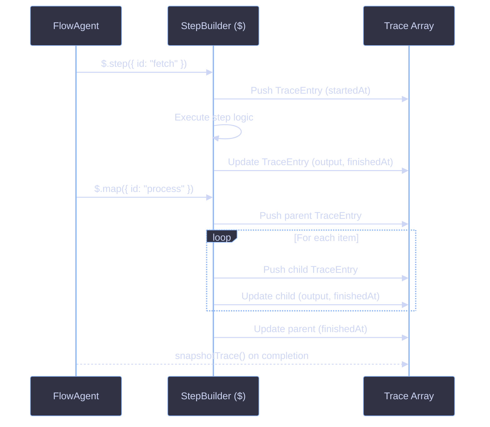

# Tracing

Every tracked `$` operation produces a `TraceEntry`. Nested operations appear as `children`, forming a tree that represents the full execution graph. The trace is exposed on `FlowAgentGenerateResult.trace` as a frozen (immutable) snapshot after execution completes.

## Architecture



## Key Concepts

### TraceEntry

A single entry in the execution trace. Every tracked `$` operation produces one.

```ts
interface TraceEntry {
  id: string;
  type: OperationType;
  input?: unknown;
  output?: unknown;
  startedAt: number;
  finishedAt?: number;
  error?: Error;
  usage?: TokenUsage;
  children?: readonly TraceEntry[];
}
```

| Field        | Type            | Description                                                 |
| ------------ | --------------- | ----------------------------------------------------------- |
| `id`         | `string`        | Unique id from the `$` config that produced this entry      |
| `type`       | `OperationType` | What kind of operation produced this entry                  |
| `input`      | `unknown`       | Input snapshot captured when the operation starts           |
| `output`     | `unknown`       | Output snapshot captured on success                         |
| `startedAt`  | `number`        | Start time in Unix milliseconds                             |
| `finishedAt` | `number`        | End time in Unix milliseconds (`undefined` while running)   |
| `error`      | `Error`         | Error instance if the operation failed                      |
| `usage`      | `TokenUsage`    | Token usage (populated for successful `agent` type entries) |
| `children`   | `TraceEntry[]`  | Nested trace entries for child operations                   |

### OperationType

Discriminant for filtering or grouping trace entries by kind:

| Value      | Source       | Description                         |
| ---------- | ------------ | ----------------------------------- |
| `"step"`   | `$.step()`   | Single unit of work                 |
| `"agent"`  | `$.agent()`  | Agent generation call               |
| `"map"`    | `$.map()`    | Parallel map operation              |
| `"each"`   | `$.each()`   | Sequential side effects             |
| `"reduce"` | `$.reduce()` | Sequential accumulation             |
| `"while"`  | `$.while()`  | Conditional loop                    |
| `"all"`    | `$.all()`    | Concurrent heterogeneous operations |
| `"race"`   | `$.race()`   | First-to-finish race                |

### Trace Tree Structure

Nested operations produce child entries. For example, a `$.map()` over 3 items with agent calls inside each iteration produces:

```
map("process-items")
  step("process-items/0")
    agent("process-items/0/summarize")
  step("process-items/1")
    agent("process-items/1/summarize")
  step("process-items/2")
    agent("process-items/2/summarize")
```

### Immutability

After execution completes, the trace is deep-cloned and frozen via `snapshotTrace()`. The result trace is fully `Object.freeze`d at every level, preventing post-run mutation.

## Usage

### Accessing the Trace

The trace is available on the flow agent result:

```ts
const result = await myFlowAgent.generate(input);

if (result.ok) {
  for (const entry of result.trace) {
    console.log(entry.id, entry.type, entry.finishedAt - entry.startedAt);
  }
}
```

### Collecting Token Usage

Use `collectUsages()` to recursively extract all `TokenUsage` values from a trace tree:

```ts
import { collectUsages } from "@funkai/agents";

const result = await myFlowAgent.generate(input);

if (result.ok) {
  const usages = collectUsages(result.trace);
  const totalTokens = usages.reduce((sum, u) => sum + u.inputTokens + u.outputTokens, 0);
  console.log("Total tokens:", totalTokens);
}
```

`collectUsages()` walks every entry including nested children and returns a flat array. Entries without `usage` are skipped.

### Filtering by Operation Type

```ts
const agentEntries = result.trace.filter((entry) => entry.type === "agent");

for (const entry of agentEntries) {
  console.log(entry.id, entry.usage?.inputTokens, entry.usage?.outputTokens);
}
```

### Traversing the Tree

Walk the trace recursively to inspect nested operations:

```ts
function walkTrace(entries: readonly TraceEntry[], depth = 0): void {
  for (const entry of entries) {
    const indent = "  ".repeat(depth);
    const duration = (entry.finishedAt ?? 0) - entry.startedAt;
    console.log(`${indent}${entry.type}(${entry.id}) ${duration}ms`);
    if (entry.children) {
      walkTrace(entry.children, depth + 1);
    }
  }
}

if (result.ok) {
  walkTrace(result.trace);
}
```

### Computing Cost from Trace

Combine `collectUsages()` with `calculateCost()` from `@funkai/models`:

```ts
import { collectUsages } from "@funkai/agents";
import { calculateCost } from "@funkai/models";

const result = await myFlowAgent.generate(input);

if (result.ok) {
  const usages = collectUsages(result.trace);
  const totalCost = usages.reduce((sum, usage) => {
    const cost = calculateCost("openai/gpt-4.1", usage);
    return sum + cost.total;
  }, 0);
  console.log(`Total cost: $${totalCost.toFixed(4)}`);
}
```

## References

- [Core Overview](overview.md)
- [Context](context.md)
- [Types](types.md)
