# Agent SDK

`@funkai/agents` is a lightweight agent orchestration framework built on the [Vercel AI SDK](https://ai-sdk.dev). It provides typed primitives for creating AI agents, tools, and multi-step workflows with observable execution traces.

## Design Principles

| Principle                      | Description                                                                                |
| ------------------------------ | ------------------------------------------------------------------------------------------ |
| Functions all the way down     | `agent()`, `tool()`, `workflow()` return plain objects, no classes                         |
| Composition over configuration | Combine small functions instead of large option bags                                       |
| Closures are state             | Workflow state is just variables in your handler                                           |
| Result, never throw            | Every public method returns `Result<T>`, callers pattern-match                             |
| Zero hidden state              | No singletons, no module-level registries                                                  |
| `$` is optional sugar          | The `$` helpers register data flow for observability; you can always use plain `for` loops |
| Context is internal            | The framework tracks execution state automatically                                         |

## Architecture

```mermaid
%%{init: {
  'theme': 'base',
  'themeVariables': {
    'primaryColor': '#313244',
    'primaryTextColor': '#cdd6f4',
    'primaryBorderColor': '#6c7086',
    'lineColor': '#89b4fa',
    'secondaryColor': '#45475a',
    'tertiaryColor': '#1e1e2e',
    'background': '#1e1e2e',
    'mainBkg': '#313244',
    'clusterBkg': '#1e1e2e',
    'clusterBorder': '#45475a'
  },
  'flowchart': { 'curve': 'basis', 'padding': 15 }
}}%%

flowchart LR
  Input:::external

  subgraph core [" "]
    tool["tool()"]:::coreNode
    agent["agent()"]:::coreNode
    workflow["workflow()"]:::coreNode
    engine["createWorkflowEngine()"]:::coreNode
  end

  subgraph steps [" "]
    direction TB
    dollar["$ (StepBuilder)"]:::step
    stepOp["$.step"]:::step
    agentOp["$.agent"]:::step
    mapOp["$.map / $.each"]:::step
    reduceOp["$.reduce / $.while"]:::step
    concOp["$.all / $.race"]:::step
  end

  subgraph provider [" "]
    direction LR
    OpenRouter:::gateway
    Model:::gateway
  end

  Input --> agent
  Input --> workflow
  agent -- ".generate() / .stream()" --> Result:::coreNode
  workflow -- ".generate() / .stream()" --> Result
  engine --> workflow
  workflow --> dollar
  dollar --> stepOp & agentOp & mapOp & reduceOp & concOp
  agentOp --> agent
  tool --> agent
  agent --> OpenRouter --> Model

  classDef external fill:#313244,stroke:#f5c2e7,stroke-width:2px,color:#cdd6f4
  classDef coreNode fill:#313244,stroke:#89b4fa,stroke-width:2px,color:#cdd6f4
  classDef step fill:#313244,stroke:#a6e3a1,stroke-width:2px,color:#cdd6f4
  classDef gateway fill:#313244,stroke:#fab387,stroke-width:2px,color:#cdd6f4

  style core fill:#181825,stroke:#89b4fa,stroke-width:2px
  style steps fill:#181825,stroke:#a6e3a1,stroke-width:2px
  style provider fill:none,stroke:#fab387,stroke-width:2px,stroke-dasharray:5 5
```



## Core Concepts

### `tool()`

Create tools for AI agent function calling. Wraps the AI SDK's `tool()` with `zodSchema()` conversion.

```ts
const fetchPage = tool({
  description: "Fetch the contents of a web page by URL",
  inputSchema: z.object({ url: z.url() }),
  execute: async ({ url }) => {
    const res = await fetch(url);
    return { url, status: res.status, body: await res.text() };
  },
});
```

### `agent()`

Create an agent with typed input, prompt template, tools, subagents, hooks, and `Result` return. Two modes:

| Config                 | `.generate()` first param | How the prompt is built        |
| ---------------------- | ------------------------- | ------------------------------ |
| `input` + `prompt` set | Typed `TInput`            | `prompt({ input })` renders it |
| Both omitted           | `string \| Message[]`     | Passed directly to the model   |

```ts
const summarizer = agent({
  name: "summarizer",
  model: "openai/gpt-4.1",
  input: z.object({ text: z.string() }),
  prompt: ({ input }) => `Summarize:\n\n${input.text}`,
});

const result = await summarizer.generate({ text: "..." });
if (result.ok) {
  console.log(result.output);
}
```

Every agent exposes `.generate()`, `.stream()`, and `.fn()`.

### `workflow()`

Create a workflow with typed I/O, `$` step builder, hooks, and execution trace. The handler IS the workflow -- state is just variables.

```ts
const wf = workflow(
  {
    name: "analyze",
    input: InputSchema,
    output: OutputSchema,
  },
  async ({ input, $ }) => {
    const data = await $.step({
      id: "fetch-data",
      execute: async () => fetchData(input.id),
    });

    const result = await $.agent({
      id: "analyze",
      agent: myAgent,
      input: { data: data.value },
    });

    return { data: data.value, analysis: result.ok ? result.output : null };
  },
);
```

The `$` step builder provides tracked operations:

| Method     | Description                                                   |
| ---------- | ------------------------------------------------------------- |
| `$.step`   | Execute a single unit of work                                 |
| `$.agent`  | Execute an agent call as a tracked operation                  |
| `$.map`    | Parallel map over items (with optional concurrency limit)     |
| `$.each`   | Sequential side effects, returns void                         |
| `$.reduce` | Sequential accumulation, each step depends on previous result |
| `$.while`  | Conditional loop, runs while a condition holds                |
| `$.all`    | Heterogeneous concurrent operations (like `Promise.all`)      |
| `$.race`   | Concurrent operations, first to finish wins                   |

### `createWorkflowEngine()`

Create a custom workflow factory that adds additional step types to `$` and/or sets default hooks.

```ts
const engine = createWorkflowEngine({
  $: {
    retry: async ({ ctx, config }) => {
      // custom step implementation with access to ExecutionContext
    },
  },
  onStart: ({ input }) => telemetry.trackStart(input),
});
```

## Key Types

### Result

Every public method returns `Result<T>` instead of throwing:

```ts
type Result<T> = (T & { ok: true }) | { ok: false; error: ResultError };
```

Error codes: `VALIDATION_ERROR`, `AGENT_ERROR`, `WORKFLOW_ERROR`, `ABORT_ERROR`. Helpers: `ok()`, `err()`, `isOk()`, `isErr()`.

### Runnable

Both `Agent` and `Workflow` satisfy the `Runnable` interface, enabling composition. Subagents passed to `agent({ agents })` are automatically wrapped as callable tools.

### Context

Internal -- never exposed to users. The framework creates it automatically. Custom step factories (via `createWorkflowEngine`) receive `ExecutionContext` with `signal` and `log`.

### Logger

Pino-compatible interface with `child()` support. The framework creates scoped child loggers at each boundary (workflow, step, agent).

## Provider

OpenRouter integration for model resolution. The `Model` type accepted by `agent()` is `string | LanguageModel` -- string IDs are resolved via OpenRouter at runtime, or pass any AI SDK provider instance directly.

| Export                       | Description                                                      |
| ---------------------------- | ---------------------------------------------------------------- |
| `openrouter(modelId)`        | Returns a `LanguageModel` (cached provider, reused across calls) |
| `createOpenRouter(options?)` | Create a new OpenRouter provider instance                        |
| `model(id)`                  | Look up a `ModelDefinition` by ID (throws if not found)          |
| `tryModel(id)`               | Look up a `ModelDefinition` by ID (returns `undefined`)          |
| `models(filter?)`            | Return all model definitions, optionally filtered                |

## Execution Trace

Workflows produce a frozen `TraceEntry[]` tree representing every tracked `$` operation:

| Field        | Type            | Description                                                         |
| ------------ | --------------- | ------------------------------------------------------------------- |
| `id`         | `string`        | Step ID from the `$` config                                         |
| `type`       | `OperationType` | `step`, `agent`, `map`, `each`, `reduce`, `while`, `all`, or `race` |
| `startedAt`  | `number`        | Unix milliseconds                                                   |
| `finishedAt` | `number?`       | Unix milliseconds (undefined while running)                         |
| `error`      | `Error?`        | Present on failure                                                  |
| `usage`      | `TokenUsage?`   | Token usage (populated for successful agent steps)                  |
| `children`   | `TraceEntry[]?` | Nested operations (iterations, sub-steps)                           |

## References

- [Agent](core/agent.md)
- [Workflow](core/workflow.md)
- [Step Builder ($)](core/step.md)
- [Tools](core/tools.md)
- [Hooks](core/hooks.md)
- [Provider](provider/overview.md)
- [Models](provider/models.md)
- [Token Usage](provider/usage.md)
- [Create an Agent](guides/create-agent.md)
- [Create a Workflow](guides/create-workflow.md)
- [Create a Tool](guides/create-tool.md)
