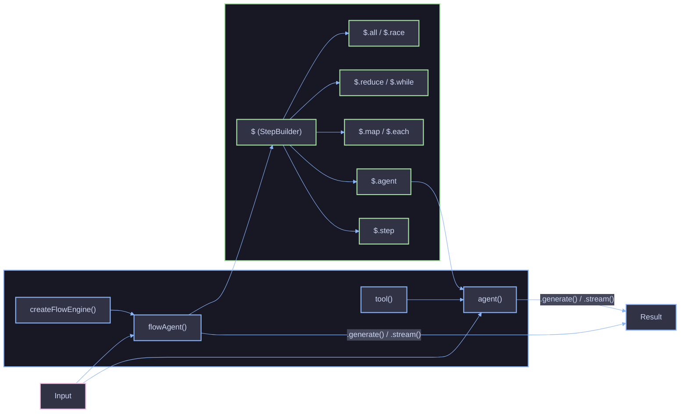

# Agent SDK

`@funkai/agents` is a lightweight agent orchestration framework built on the [Vercel AI SDK](https://ai-sdk.dev). It provides typed primitives for creating AI agents, tools, and multi-step flow agents with observable execution traces.

## Architecture

```mermaid
%%{init: {
  'theme': 'base',
  'themeVariables': {
    'primaryColor': '#313244',
    'primaryTextColor': '#cdd6f4',
    'primaryBorderColor': '#6c7086',
    'lineColor': '#89b4fa',
    'secondaryColor': '#45475a',
    'tertiaryColor': '#1e1e2e',
    'background': '#1e1e2e',
    'mainBkg': '#313244',
    'clusterBkg': '#1e1e2e',
    'clusterBorder': '#45475a'
  },
  'flowchart': { 'curve': 'basis', 'padding': 15 }
}}%%

flowchart LR
  Input:::external

  subgraph core [" "]
    tool["tool()"]:::coreNode
    agent["agent()"]:::coreNode
    flowAgent["flowAgent()"]:::coreNode
    engine["createFlowEngine()"]:::coreNode
  end

  subgraph steps [" "]
    direction TB
    dollar["$ (StepBuilder)"]:::step
    stepOp["$.step"]:::step
    agentOp["$.agent"]:::step
    mapOp["$.map / $.each"]:::step
    reduceOp["$.reduce / $.while"]:::step
    concOp["$.all / $.race"]:::step
  end

  Input --> agent
  Input --> flowAgent
  agent -- ".generate() / .stream()" --> Result:::coreNode
  flowAgent -- ".generate() / .stream()" --> Result
  engine --> flowAgent
  flowAgent --> dollar
  dollar --> stepOp & agentOp & mapOp & reduceOp & concOp
  agentOp --> agent
  tool --> agent

  classDef external fill:#313244,stroke:#f5c2e7,stroke-width:2px,color:#cdd6f4
  classDef coreNode fill:#313244,stroke:#89b4fa,stroke-width:2px,color:#cdd6f4
  classDef step fill:#313244,stroke:#a6e3a1,stroke-width:2px,color:#cdd6f4

  style core fill:#181825,stroke:#89b4fa,stroke-width:2px
  style steps fill:#181825,stroke:#a6e3a1,stroke-width:2px
```

## Primitives

| Primitive                                     | Description                                                                      |
| --------------------------------------------- | -------------------------------------------------------------------------------- |
| [`agent()`](create-agent.md)                  | Create an AI agent with typed I/O, tools, subagents, hooks, and `Result` return  |
| [`flowAgent()`](create-flow-agent.md)         | Create a multi-step orchestration flow with `$` step builder and execution trace |
| [`tool()`](tools.md)                          | Create tools for AI agent function calling                                       |
| [`createFlowEngine()`](custom-flow-engine.md) | Create a flow agent factory with custom step types and shared hooks              |

## Key Concepts

- **Result, never throw** -- Every public method returns `Result<T>`. Pattern-match on `ok` instead of try/catch.
- **LanguageModel instances** -- Pass AI SDK provider instances directly: `model: openai("gpt-4.1")`. Use any `@ai-sdk/*` package.
- **$ is optional sugar** -- The `$` helpers register data flow for observability; plain imperative code works too.
- **Closures are state** -- Flow agent state is just `let` variables in your handler.

## Documentation

| Topic                                                     | Description                                                          |
| --------------------------------------------------------- | -------------------------------------------------------------------- |
| [Create an Agent](create-agent.md)                        | Build agents with typed I/O, tools, output strategies, and streaming |
| [Create a Flow Agent](create-flow-agent.md)               | Build multi-step flows with `$` operations and execution traces      |
| [Step Builder ($)](step-builder.md)                       | Reference for all 8 `$` methods                                      |
| [Tools](tools.md)                                         | Create and register tools for function calling                       |
| [Hooks](hooks.md)                                         | Lifecycle callbacks for agents and flow agents                       |
| [Streaming](streaming.md)                                 | Stream consumption patterns and StreamPart events                    |
| [Middleware](middleware.md)                               | Wrap language models with AI SDK middleware                          |
| [Output Strategies](output-strategies.md)                 | Structured output with Output.text/object/array/choice               |
| [Custom Flow Engine](custom-flow-engine.md)               | Build custom step types with createFlowEngine()                      |
| [Testing](test-agents.md)                                 | Patterns for testing agents and flow agents                          |
| [Cost Tracking](cost-tracking.md)                         | Track token usage and calculate costs                                |
| [Error Recovery](error-recovery.md)                       | Retry, fallback, and circuit breaker patterns                        |
| [Multi-Agent Orchestration](multi-agent-orchestration.md) | Sequential, parallel, voting, and hierarchical patterns              |
