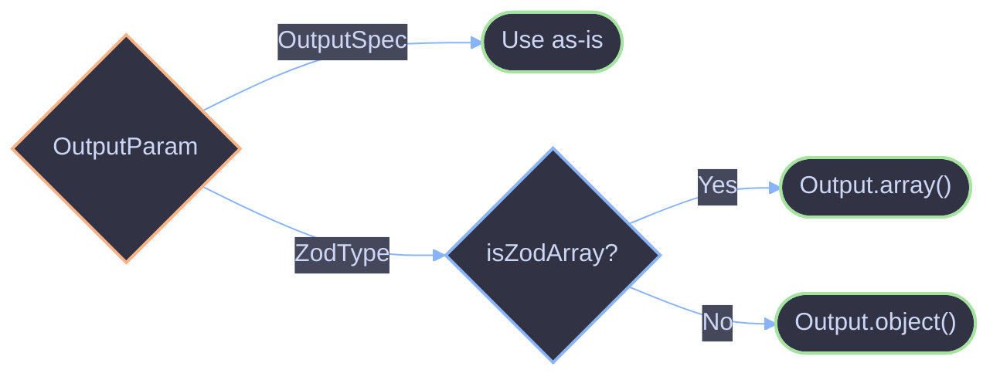

# Output Strategies

Output strategies control the shape and validation of agent generation output. The `output` field on `AgentConfig` accepts either an AI SDK `Output` strategy or a raw Zod schema, which the framework auto-wraps.

## Architecture



## Key Concepts

### OutputParam

The accepted type for the `output` config field:

```ts
type OutputParam = OutputSpec | ZodType;
```

When a raw `ZodType` is passed, the framework resolves it via `resolveOutput()`:

- `z.array(...)` becomes `Output.array({ element: innerSchema })`
- Anything else becomes `Output.object({ schema })`

### Available Strategies

| Strategy                     | Output Type      | Description                                |
| ---------------------------- | ---------------- | ------------------------------------------ |
| `Output.text()`              | `string`         | Plain text (default when `output` omitted) |
| `Output.object({ schema })`  | Schema type `T`  | Validated structured object                |
| `Output.array({ element })`  | `T[]`            | Validated array of elements                |
| `Output.choice({ options })` | Union of options | Enum/classification                        |
| `z.object({ ... })`          | Schema type `T`  | Auto-wrapped as `Output.object()`          |
| `z.array(z.object({ ... }))` | `T[]`            | Auto-wrapped as `Output.array()`           |

### Resolution Logic

The `resolveOutput()` function distinguishes between `OutputSpec` and `ZodType` by checking for the presence of `parseCompleteOutput` -- a method that exists on AI SDK `Output` instances but not on Zod schemas.

## Usage

### Output.text() (Default)

When `output` is omitted, agents produce plain string output:

```ts
const helper = agent({
  name: "helper",
  model: "openai/gpt-4.1",
  system: "You are helpful.",
});

const result = await helper.generate("What is TypeScript?");
if (result.ok) {
  console.log(result.output); // string
}
```

### Output.object()

Produce a validated structured object:

```ts
import { Output } from "ai";

const analyzer = agent({
  name: "analyzer",
  model: "openai/gpt-4.1",
  system: "Analyze the sentiment of the given text.",
  output: Output.object({
    schema: z.object({
      sentiment: z.enum(["positive", "negative", "neutral"]),
      confidence: z.number().min(0).max(1),
      reasoning: z.string(),
    }),
  }),
});

const result = await analyzer.generate("I love this product!");
if (result.ok) {
  console.log(result.output.sentiment); // "positive"
  console.log(result.output.confidence); // 0.95
}
```

### Output.array()

Produce a validated array of structured elements:

```ts
import { Output } from "ai";

const extractor = agent({
  name: "extractor",
  model: "openai/gpt-4.1",
  system: "Extract all entities from the text.",
  output: Output.array({
    element: z.object({
      name: z.string(),
      type: z.enum(["person", "organization", "location"]),
    }),
  }),
});

const result = await extractor.generate("Alice works at Acme Corp in New York.");
if (result.ok) {
  for (const entity of result.output) {
    console.log(entity.name, entity.type);
  }
}
```

### Output.choice()

Classify input into one of a set of options:

```ts
import { Output } from "ai";

const classifier = agent({
  name: "classifier",
  model: "openai/gpt-4.1",
  system: "Classify the support ticket priority.",
  output: Output.choice({
    options: ["low", "medium", "high", "critical"] as const,
  }),
});

const result = await classifier.generate("Server is completely down");
if (result.ok) {
  console.log(result.output); // "critical"
}
```

### Zod Schema Auto-Wrapping

Pass a raw Zod schema instead of an explicit `Output` strategy -- the framework wraps it automatically:

```ts
// Equivalent to Output.object({ schema })
const summarizer = agent({
  name: "summarizer",
  model: "openai/gpt-4.1",
  system: "Summarize the input text.",
  output: z.object({
    summary: z.string(),
    keyPoints: z.array(z.string()),
  }),
});

// Equivalent to Output.array({ element })
const tagGenerator = agent({
  name: "tag-generator",
  model: "openai/gpt-4.1",
  system: "Generate tags for the input.",
  output: z.array(
    z.object({
      tag: z.string(),
      relevance: z.number(),
    }),
  ),
});
```

### Per-Call Output Override

Override the output strategy for a single call via `AgentOverrides`:

```ts
const result = await helper.generate("List three TypeScript features", {
  output: z.object({
    features: z.array(z.string()),
  }),
});
```

### Validation Error Handling

When the model's output does not match the schema, the result contains a `VALIDATION_ERROR`:

```ts
const result = await analyzer.generate("Analyze this");

if (!result.ok && result.error.code === "VALIDATION_ERROR") {
  console.error("Output did not match schema:", result.error.message);
  if (result.error.cause) {
    console.error("Zod error:", result.error.cause);
  }
}
```

## References

- [Agent](../core/agent.md)
- [Core Types](../core/types.md)
- [Core Overview](../core/overview.md)
