# Model Catalog

The model catalog is an auto-generated, readonly collection of `ModelDefinition` objects sourced from [models.dev](https://models.dev). It provides lookup functions, type-safe IDs with autocomplete, and per-provider subpath exports.

## Architecture

```mermaid
%%{init: {
  'theme': 'base',
  'themeVariables': {
    'primaryColor': '#313244',
    'primaryTextColor': '#cdd6f4',
    'primaryBorderColor': '#6c7086',
    'lineColor': '#89b4fa',
    'secondaryColor': '#45475a',
    'tertiaryColor': '#1e1e2e',
    'background': '#1e1e2e',
    'mainBkg': '#313244',
    'clusterBkg': '#1e1e2e',
    'clusterBorder': '#45475a'
  },
  'flowchart': { 'curve': 'basis', 'padding': 15 }
}}%%

flowchart LR
  source["models.dev API"]:::external

  subgraph generation [" "]
    script["generate:models script"]:::core
    providers["Per-provider .ts files"]:::core
  end

  subgraph catalog [" "]
    MODELS["MODELS constant"]:::core
    modelFn["model(id)"]:::core
    modelsFn["models(filter?)"]:::core
  end

  source --> script
  script --> providers
  providers --> MODELS
  MODELS --> modelFn
  MODELS --> modelsFn

  classDef external fill:#313244,stroke:#f5c2e7,stroke-width:2px,color:#cdd6f4
  classDef core fill:#313244,stroke:#89b4fa,stroke-width:2px,color:#cdd6f4

  style generation fill:#181825,stroke:#fab387,stroke-width:2px
  style catalog fill:#181825,stroke:#89b4fa,stroke-width:2px
```



## ModelDefinition

Each model has the following fields:

| Field           | Type                | Description                                    |
| --------------- | ------------------- | ---------------------------------------------- |
| `id`            | `string`            | Provider-native identifier (e.g. `"gpt-4.1"`)  |
| `name`          | `string`            | Human-readable display name                    |
| `provider`      | `string`            | Provider slug (e.g. `"openai"`)                |
| `family`        | `string`            | Model family (e.g. `"gpt"`, `"claude-sonnet"`) |
| `pricing`       | `ModelPricing`      | Per-token pricing rates in USD                 |
| `contextWindow` | `number`            | Maximum context window in tokens               |
| `maxOutput`     | `number`            | Maximum output tokens                          |
| `modalities`    | `ModelModalities`   | Supported input/output modalities              |
| `capabilities`  | `ModelCapabilities` | Boolean capability flags                       |

### ModelPricing

| Field        | Type                  | Description                         |
| ------------ | --------------------- | ----------------------------------- |
| `input`      | `number`              | Cost per input token                |
| `output`     | `number`              | Cost per output token               |
| `cacheRead`  | `number \| undefined` | Cost per cached input token (read)  |
| `cacheWrite` | `number \| undefined` | Cost per cached input token (write) |
| `reasoning`  | `number \| undefined` | Cost per reasoning token            |

### ModelCapabilities

| Field              | Type      | Description                      |
| ------------------ | --------- | -------------------------------- |
| `reasoning`        | `boolean` | Supports chain-of-thought        |
| `toolCall`         | `boolean` | Supports tool (function) calling |
| `attachment`       | `boolean` | Supports file/image attachments  |
| `structuredOutput` | `boolean` | Supports structured JSON output  |

### ModelModalities

| Field    | Type                | Description                                          |
| -------- | ------------------- | ---------------------------------------------------- |
| `input`  | `readonly string[]` | Accepted input modalities (e.g. `"text"`, `"image"`) |
| `output` | `readonly string[]` | Produced output modalities                           |

## Lookup API

### Look Up a Single Model

`model(id)` returns the matching `ModelDefinition` or `null`:

```ts
import { model } from "@funkai/models";

const m = model("gpt-4.1");
if (m) {
  console.log(m.name);
  console.log(m.pricing.input);
  console.log(m.capabilities.reasoning);
}
```

### Get All Models

`models()` returns the full catalog. Pass a predicate to filter:

```ts
import { models } from "@funkai/models";

const all = models();
const withTools = models((m) => m.capabilities.toolCall);
```

### Access the Raw Catalog

`MODELS` is the complete readonly array, useful when you need direct iteration:

```ts
import { MODELS } from "@funkai/models";

const providers = new Set(MODELS.map((m) => m.provider));
```

## ModelId Type

`ModelId` provides autocomplete for known model IDs while accepting arbitrary strings for new or custom models. Values use the **provider-native name** (e.g. `"gpt-4.1"`, `"claude-sonnet-4-20250514"`), which is the same format accepted by the `model()` lookup function:

```ts
import type { ModelId } from "@funkai/models";

const id: ModelId = "gpt-4.1";
```

> **Note:** The `provider/model` format (e.g. `"openai/gpt-4.1"`) is only used with `createProviderRegistry()` for routing to the correct AI SDK provider. The `ModelId` type and `model()` function always use the native model name without a provider prefix.

## Filtering Patterns

`models()` accepts an optional predicate function `(m: ModelDefinition) => boolean`. When provided, only models where the predicate returns `true` are included.

### Filter by Capability

```ts
const reasoning = models((m) => m.capabilities.reasoning);
const withTools = models((m) => m.capabilities.toolCall);
const structured = models((m) => m.capabilities.structuredOutput);
```

### Filter by Provider

```ts
const openai = models((m) => m.provider === "openai");
const anthropic = models((m) => m.provider === "anthropic");
```

### Filter by Modality

```ts
const vision = models((m) => m.modalities.input.includes("image"));
const audio = models((m) => m.modalities.input.includes("audio"));
const multimodal = models((m) => m.modalities.input.length > 1);
```

### Filter by Context Window

```ts
const largeContext = models((m) => m.contextWindow >= 128_000);
const longOutput = models((m) => m.maxOutput >= 16_000);
```

### Filter by Pricing

```ts
const cheapInput = models((m) => m.pricing.input < 0.000001);
const withCache = models((m) => m.pricing.cacheRead != null);
```

### Filter by Family

```ts
const gpt = models((m) => m.family === "gpt");
const claude = models((m) => m.family.startsWith("claude"));
```

### Combine Multiple Conditions

```ts
const ideal = models(
  (m) =>
    m.capabilities.reasoning &&
    m.capabilities.toolCall &&
    m.contextWindow >= 128_000 &&
    m.pricing.input < 0.00001,
);
```

### Sort by Price

```ts
const cheapest = models((m) => m.capabilities.reasoning).toSorted(
  (a, b) => a.pricing.input - b.pricing.input,
);

const pick = cheapest[0];
```

### Extract Unique Values

```ts
const providers = [...new Set(models().map((m) => m.provider))];
const families = [...new Set(models().map((m) => m.family))];
```

### Per-Provider Filtering

Use subpath exports for provider-scoped operations:

```ts
import { openAIModels } from "@funkai/models/openai";

const reasoningGpt = openAIModels.filter((m) => m.capabilities.reasoning);
```

## Supported Providers

The model catalog includes models from 21 providers. Each provider has a dedicated subpath export and a prefix used in model IDs.

| Provider       | Prefix           | Subpath Import                  |
| -------------- | ---------------- | ------------------------------- |
| OpenAI         | `openai`         | `@funkai/models/openai`         |
| Anthropic      | `anthropic`      | `@funkai/models/anthropic`      |
| Google         | `google`         | `@funkai/models/google`         |
| Google Vertex  | `google-vertex`  | `@funkai/models/google-vertex`  |
| Mistral        | `mistral`        | `@funkai/models/mistral`        |
| Amazon Bedrock | `amazon-bedrock` | `@funkai/models/amazon-bedrock` |
| Groq           | `groq`           | `@funkai/models/groq`           |
| DeepSeek       | `deepseek`       | `@funkai/models/deepseek`       |
| xAI            | `xai`            | `@funkai/models/xai`            |
| Cohere         | `cohere`         | `@funkai/models/cohere`         |
| Fireworks AI   | `fireworks-ai`   | `@funkai/models/fireworks-ai`   |
| Together AI    | `togetherai`     | `@funkai/models/togetherai`     |
| DeepInfra      | `deepinfra`      | `@funkai/models/deepinfra`      |
| Cerebras       | `cerebras`       | `@funkai/models/cerebras`       |
| Perplexity     | `perplexity`     | `@funkai/models/perplexity`     |
| OpenRouter     | `openrouter`     | `@funkai/models/openrouter`     |
| Llama          | `llama`          | `@funkai/models/llama`          |
| Alibaba        | `alibaba`        | `@funkai/models/alibaba`        |
| NVIDIA         | `nvidia`         | `@funkai/models/nvidia`         |
| Hugging Face   | `huggingface`    | `@funkai/models/huggingface`    |
| Inception      | `inception`      | `@funkai/models/inception`      |

## Per-Provider Subpath Exports

Each provider subpath exports three members following a consistent naming pattern:

| Export              | Type       | Description                                      |
| ------------------- | ---------- | ------------------------------------------------ |
| `<provider>Models`  | `const`    | Readonly array of `ModelDefinition` for provider |
| `<provider>Model`   | `function` | Look up a model by ID, returns `null` if missing |
| `<Provider>ModelId` | `type`     | Union type of known model IDs for the provider   |

```ts
import { anthropicModels, anthropicModel } from "@funkai/models/anthropic";
import type { AnthropicModelId } from "@funkai/models/anthropic";

const id: AnthropicModelId = "claude-sonnet-4-20250514";

const m = anthropicModel(id);
if (m) {
  console.log(m.name, m.pricing.input);
}

const withReasoning = anthropicModels.filter((m) => m.capabilities.reasoning);
```

Model IDs in the catalog use the format `<provider-native-id>` (e.g. `"gpt-4.1"`, `"claude-sonnet-4-20250514"`). When used with `createProviderRegistry()`, prefix them with the provider slug: `"openai/gpt-4.1"`, `"anthropic/claude-sonnet-4-20250514"`.

## Updating the Catalog

Regenerate the catalog from models.dev:

```bash
pnpm --filter=@funkai/models generate:models
```

Force-regenerate (ignoring staleness cache):

```bash
pnpm --filter=@funkai/models generate:models --force
```

This requires `OPENROUTER_API_KEY` to be set in the environment.

## References

- [Provider Resolution](provider-resolution.md)
- [Cost Tracking](cost-tracking.md)
- [Troubleshooting](troubleshooting.md)
