# Model Catalog

The model catalog is an auto-generated, readonly collection of `ModelDefinition` objects sourced from [models.dev](https://models.dev). It provides lookup functions, type-safe IDs with autocomplete, and per-provider subpath exports.

## Architecture

```mermaid
%%{init: {
  'theme': 'base',
  'themeVariables': {
    'primaryColor': '#313244',
    'primaryTextColor': '#cdd6f4',
    'primaryBorderColor': '#6c7086',
    'lineColor': '#89b4fa',
    'secondaryColor': '#45475a',
    'tertiaryColor': '#1e1e2e',
    'background': '#1e1e2e',
    'mainBkg': '#313244',
    'clusterBkg': '#1e1e2e',
    'clusterBorder': '#45475a'
  },
  'flowchart': { 'curve': 'basis', 'padding': 15 }
}}%%

flowchart LR
  source["models.dev API"]:::external

  subgraph generation [" "]
    script["generate:models script"]:::core
    providers["Per-provider .ts files"]:::core
  end

  subgraph catalog [" "]
    MODELS["MODELS constant"]:::core
    modelFn["model(id)"]:::core
    modelsFn["models(filter?)"]:::core
  end

  source --> script
  script --> providers
  providers --> MODELS
  MODELS --> modelFn
  MODELS --> modelsFn

  classDef external fill:#313244,stroke:#f5c2e7,stroke-width:2px,color:#cdd6f4
  classDef core fill:#313244,stroke:#89b4fa,stroke-width:2px,color:#cdd6f4

  style generation fill:#181825,stroke:#fab387,stroke-width:2px
  style catalog fill:#181825,stroke:#89b4fa,stroke-width:2px
```



## Key Concepts

### ModelDefinition

Each model has the following fields:

| Field           | Type                | Description                                    |
| --------------- | ------------------- | ---------------------------------------------- |
| `id`            | `string`            | Provider-native identifier (e.g. `"gpt-4.1"`)  |
| `name`          | `string`            | Human-readable display name                    |
| `provider`      | `string`            | Provider slug (e.g. `"openai"`)                |
| `family`        | `string`            | Model family (e.g. `"gpt"`, `"claude-sonnet"`) |
| `pricing`       | `ModelPricing`      | Per-token pricing rates in USD                 |
| `contextWindow` | `number`            | Maximum context window in tokens               |
| `maxOutput`     | `number`            | Maximum output tokens                          |
| `modalities`    | `ModelModalities`   | Supported input/output modalities              |
| `capabilities`  | `ModelCapabilities` | Boolean capability flags                       |

### ModelPricing

| Field        | Type                  | Description                         |
| ------------ | --------------------- | ----------------------------------- |
| `input`      | `number`              | Cost per input token                |
| `output`     | `number`              | Cost per output token               |
| `cacheRead`  | `number \| undefined` | Cost per cached input token (read)  |
| `cacheWrite` | `number \| undefined` | Cost per cached input token (write) |

### ModelCapabilities

| Field              | Type      | Description                      |
| ------------------ | --------- | -------------------------------- |
| `reasoning`        | `boolean` | Supports chain-of-thought        |
| `toolCall`         | `boolean` | Supports tool (function) calling |
| `attachment`       | `boolean` | Supports file/image attachments  |
| `structuredOutput` | `boolean` | Supports structured JSON output  |

### ModelModalities

| Field    | Type                | Description                                          |
| -------- | ------------------- | ---------------------------------------------------- |
| `input`  | `readonly string[]` | Accepted input modalities (e.g. `"text"`, `"image"`) |
| `output` | `readonly string[]` | Produced output modalities                           |

## Usage

### Look Up a Single Model

`model(id)` returns the matching `ModelDefinition` or `null`:

```ts
const m = model("openai/gpt-4.1");
if (m) {
  console.log(m.name);
  console.log(m.pricing.input);
  console.log(m.capabilities.reasoning);
}
```

### Get All Models

`models()` returns the full catalog. Pass a predicate to filter:

```ts
const all = models();
const withTools = models((m) => m.capabilities.toolCall);
```

### Access the Raw Catalog

`MODELS` is the complete readonly array, useful when you need direct iteration:

```ts
const providers = new Set(MODELS.map((m) => m.provider));
```

### Type-Safe Model IDs

`ModelId` provides autocomplete for known model IDs while accepting arbitrary strings for new or custom models:

```ts
import type { ModelId } from "@funkai/models";

const id: ModelId = "openai/gpt-4.1";
```

### Per-Provider Subpath Exports

Each provider has a dedicated subpath with a filtered model list, lookup function, and typed ID:

```ts
import { openAIModels, openAIModel } from "@funkai/models/openai";

const m = openAIModel("gpt-4o-2024-11-20");
```

## Updating the Catalog

Regenerate the catalog from models.dev:

```bash
pnpm --filter=@funkai/models generate:models
```

Force-regenerate (ignoring staleness cache):

```bash
pnpm --filter=@funkai/models generate:models --force
```

This requires `OPENROUTER_API_KEY` to be set in the environment.

## References

- [Filtering](filtering.md)
- [Providers](providers.md)
- [Provider Resolution](../provider/overview.md)
- [Cost Calculation](../cost/overview.md)
