# Models

`@funkai/models` provides a generated model catalog, configurable provider resolution, and token cost calculations for the funkai AI SDK.

## Architecture

```mermaid
%%{init: {
  'theme': 'base',
  'themeVariables': {
    'primaryColor': '#313244',
    'primaryTextColor': '#cdd6f4',
    'primaryBorderColor': '#6c7086',
    'lineColor': '#89b4fa',
    'secondaryColor': '#45475a',
    'tertiaryColor': '#1e1e2e',
    'background': '#1e1e2e',
    'mainBkg': '#313244',
    'clusterBkg': '#1e1e2e',
    'clusterBorder': '#45475a'
  },
  'flowchart': { 'curve': 'basis', 'padding': 15 }
}}%%

flowchart LR
  ModelId["Model ID"]:::external

  subgraph catalog [" "]
    direction TB
    MODELS["MODELS catalog"]:::core
    lookup["model() / models()"]:::core
    filter["Filter predicates"]:::core
  end

  subgraph resolver [" "]
    direction TB
    createResolver["createModelResolver()"]:::core
    providers["Provider map"]:::gateway
    fallback["Fallback (OpenRouter)"]:::gateway
  end

  subgraph cost [" "]
    direction TB
    calcCost["calculateCost()"]:::agent
    usage["TokenUsage"]:::agent
    pricing["ModelPricing"]:::agent
  end

  ModelId --> lookup
  MODELS --> lookup
  lookup --> filter
  ModelId --> createResolver
  createResolver --> providers
  createResolver --> fallback
  providers --> LanguageModel["LanguageModel"]:::external
  fallback --> LanguageModel
  usage --> calcCost
  pricing --> calcCost
  calcCost --> UsageCost["UsageCost"]:::external

  classDef external fill:#313244,stroke:#f5c2e7,stroke-width:2px,color:#cdd6f4
  classDef core fill:#313244,stroke:#89b4fa,stroke-width:2px,color:#cdd6f4
  classDef gateway fill:#313244,stroke:#fab387,stroke-width:2px,color:#cdd6f4
  classDef agent fill:#313244,stroke:#a6e3a1,stroke-width:2px,color:#cdd6f4

  style catalog fill:#181825,stroke:#89b4fa,stroke-width:2px
  style resolver fill:#181825,stroke:#fab387,stroke-width:2px
  style cost fill:#181825,stroke:#a6e3a1,stroke-width:2px
```



The package has three domains:

| Domain       | Purpose                                      | Key Exports                           |
| ------------ | -------------------------------------------- | ------------------------------------- |
| **Catalog**  | Generated model metadata from models.dev     | `model()`, `models()`, `MODELS`       |
| **Provider** | Resolve model IDs to AI SDK `LanguageModel`s | `createModelResolver()`, `openrouter` |
| **Cost**     | Calculate USD costs from token usage         | `calculateCost()`                     |

## Key Concepts

### Model Definitions

Every model in the catalog is a `ModelDefinition` with pricing, capabilities, modalities, and context window metadata. The catalog is auto-generated from [models.dev](https://models.dev) and updated via `pnpm --filter=@funkai/models generate:models`.

### Provider Resolution

`createModelResolver()` maps model ID prefixes (e.g. `"openai"` from `"openai/gpt-4.1"`) to AI SDK provider factories. Unmapped prefixes fall through to an optional fallback (typically OpenRouter).

### Cost Calculation

`calculateCost()` multiplies token counts by per-token pricing rates. Pricing is stored per-token in the catalog (converted from per-million at generation time), so no runtime conversion is needed.

## Usage

### Look Up a Model

```ts
const m = model("openai/gpt-4.1");
if (m) {
  console.log(m.name, m.contextWindow, m.capabilities.reasoning);
}
```

### Filter Models

```ts
const reasoning = models((m) => m.capabilities.reasoning);
const multimodal = models((m) => m.modalities.input.includes("image"));
```

### Resolve a Model

```ts
const resolve = createModelResolver({
  fallback: openrouter,
});
const lm = resolve("openai/gpt-4.1");
```

### Calculate Cost

```ts
const cost = calculateCost(usage, m.pricing);
console.log(`Total: $${cost.total.toFixed(6)}`);
```

## References

- [Model Catalog](catalog/overview.md)
- [Filtering](catalog/filtering.md)
- [Providers](catalog/providers.md)
- [Provider Resolution](provider/overview.md)
- [Configuration](provider/configuration.md)
- [OpenRouter](provider/openrouter.md)
- [Cost Calculation](cost/overview.md)
- [Setup Resolver Guide](guides/setup-resolver.md)
- [Filter Models Guide](guides/filter-models.md)
- [Track Costs Guide](guides/track-costs.md)
- [Troubleshooting](troubleshooting.md)
