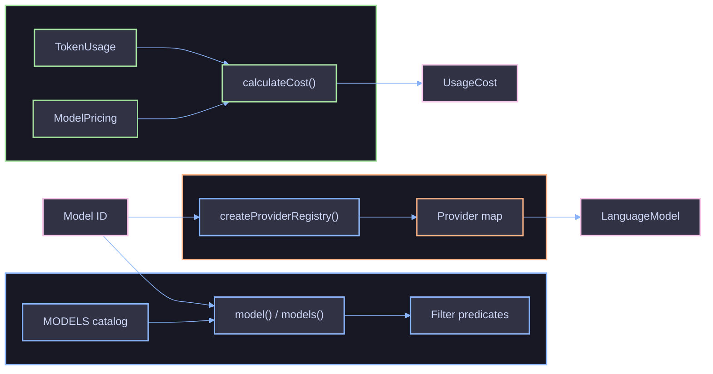

# Models

`@funkai/models` provides a generated model catalog, configurable provider resolution, and token cost calculations for the funkai AI SDK.

## Architecture

```mermaid
%%{init: {
  'theme': 'base',
  'themeVariables': {
    'primaryColor': '#313244',
    'primaryTextColor': '#cdd6f4',
    'primaryBorderColor': '#6c7086',
    'lineColor': '#89b4fa',
    'secondaryColor': '#45475a',
    'tertiaryColor': '#1e1e2e',
    'background': '#1e1e2e',
    'mainBkg': '#313244',
    'clusterBkg': '#1e1e2e',
    'clusterBorder': '#45475a'
  },
  'flowchart': { 'curve': 'basis', 'padding': 15 }
}}%%

flowchart LR
  ModelId["Model ID"]:::external

  subgraph catalog [" "]
    direction TB
    MODELS["MODELS catalog"]:::core
    lookup["model() / models()"]:::core
    filter["Filter predicates"]:::core
  end

  subgraph resolver [" "]
    direction TB
    createRegistry["createProviderRegistry()"]:::core
    providers["Provider map"]:::gateway
  end

  subgraph cost [" "]
    direction TB
    calcCost["calculateCost()"]:::agent
    usage["TokenUsage"]:::agent
    pricing["ModelPricing"]:::agent
  end

  ModelId --> lookup
  MODELS --> lookup
  lookup --> filter
  ModelId --> createRegistry
  createRegistry --> providers
  providers --> LanguageModel["LanguageModel"]:::external
  usage --> calcCost
  pricing --> calcCost
  calcCost --> UsageCost["UsageCost"]:::external

  classDef external fill:#313244,stroke:#f5c2e7,stroke-width:2px,color:#cdd6f4
  classDef core fill:#313244,stroke:#89b4fa,stroke-width:2px,color:#cdd6f4
  classDef gateway fill:#313244,stroke:#fab387,stroke-width:2px,color:#cdd6f4
  classDef agent fill:#313244,stroke:#a6e3a1,stroke-width:2px,color:#cdd6f4

  style catalog fill:#181825,stroke:#89b4fa,stroke-width:2px
  style resolver fill:#181825,stroke:#fab387,stroke-width:2px
  style cost fill:#181825,stroke:#a6e3a1,stroke-width:2px
```

## Three Domains

| Domain       | Purpose                                      | Key Exports                     |
| ------------ | -------------------------------------------- | ------------------------------- |
| **Catalog**  | Generated model metadata from models.dev     | `model()`, `models()`, `MODELS` |
| **Provider** | Resolve model IDs to AI SDK `LanguageModel`s | `createProviderRegistry()`      |
| **Cost**     | Calculate USD costs from token usage         | `calculateCost()`               |

## Documentation

| Topic                                         | Description                                                                 |
| --------------------------------------------- | --------------------------------------------------------------------------- |
| [Model Catalog](catalog.md)                   | Model definitions, lookup API, filtering patterns, provider subpath exports |
| [Provider Resolution](provider-resolution.md) | Resolution algorithm, registry configuration, OpenRouter integration        |
| [Cost Tracking](cost-tracking.md)             | calculateCost() API, types, formula, usage patterns                         |
| [Troubleshooting](troubleshooting.md)         | Common errors and fixes                                                     |
