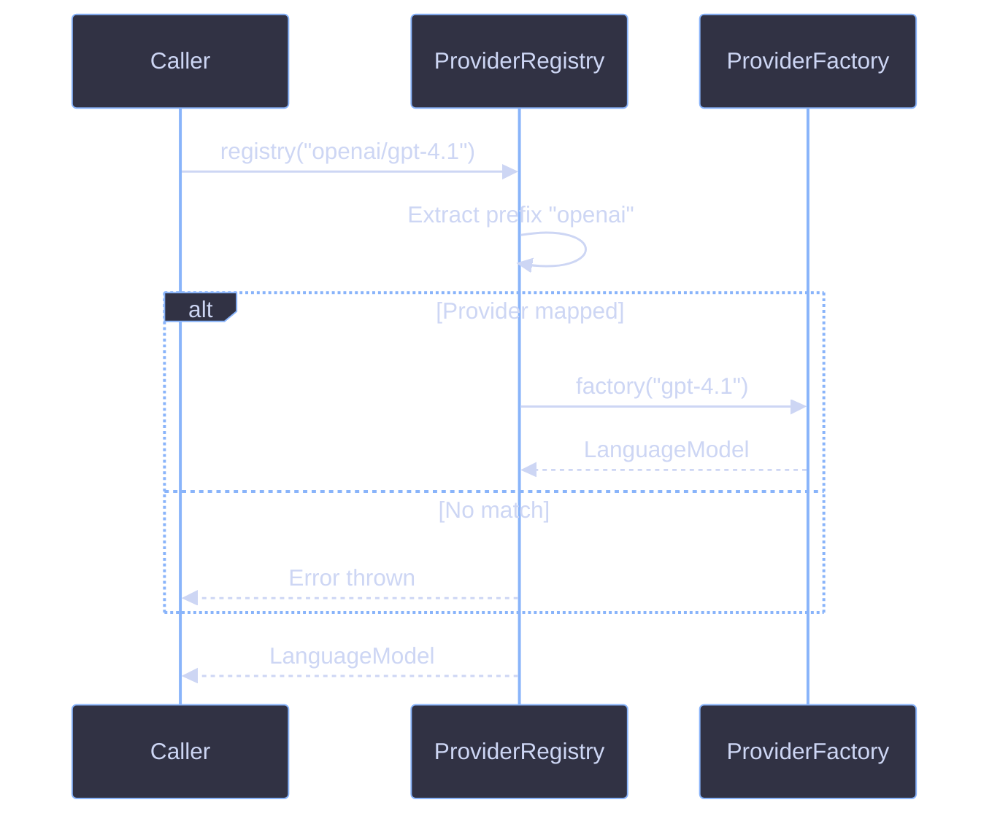

# Provider Resolution

Provider resolution maps model ID strings to AI SDK `LanguageModel` instances. `createProviderRegistry()` extracts the provider prefix from a model ID and dispatches to the appropriate provider factory.

## How It Works



When `registry("openai/gpt-4.1")` is called:

1. The model ID is validated (non-empty)
2. The prefix before the first `/` is extracted (`"openai"`)
3. If a provider factory is mapped for that prefix, it receives the model portion (`"gpt-4.1"`)
4. If no provider matches, an error is thrown

Model IDs without a `/` (e.g. `"gpt-4.1"`) have no prefix to match, so an error is thrown. Always use the full `"provider/model"` format.

## createProviderRegistry() API

### ProviderRegistryConfig

| Option      | Type          | Default | Description                               |
| ----------- | ------------- | ------- | ----------------------------------------- |
| `providers` | `ProviderMap` | `{}`    | Direct AI SDK provider mappings by prefix |

A registry with no providers throws on every call.

### ProviderMap

`ProviderMap` is `Readonly<Record<string, ProviderFactory>>`. Keys are provider prefixes that match the portion before `/` in a model ID.

```ts
const providers: ProviderMap = {
  openai: createOpenAI({ apiKey: process.env.OPENAI_API_KEY }),
  anthropic: createAnthropic({ apiKey: process.env.ANTHROPIC_API_KEY }),
};
```

### ProviderFactory

`ProviderFactory` is `(modelName: string) => LanguageModel`. AI SDK provider constructors (`createOpenAI`, `createAnthropic`, etc.) return compatible factory functions.

```ts
import { createOpenAI } from "@ai-sdk/openai";

const factory: ProviderFactory = createOpenAI({ apiKey: "..." });
const lm = factory("gpt-4.1");
```

## Setting Up Providers

### Install Provider SDKs

Install the AI SDK providers you want to use:

```bash
pnpm add @ai-sdk/openai @ai-sdk/anthropic
```

### Basic Registry

```ts
import { createProviderRegistry } from "@funkai/models";
import { createOpenAI } from "@ai-sdk/openai";

const registry = createProviderRegistry({
  providers: {
    openai: createOpenAI({ apiKey: process.env.OPENAI_API_KEY }),
  },
});

const lm = registry("openai/gpt-4.1");
```

### Multi-Provider Registry

```ts
import { createProviderRegistry } from "@funkai/models";
import { createOpenAI } from "@ai-sdk/openai";
import { createAnthropic } from "@ai-sdk/anthropic";

const registry = createProviderRegistry({
  providers: {
    openai: createOpenAI({ apiKey: process.env.OPENAI_API_KEY }),
    anthropic: createAnthropic({ apiKey: process.env.ANTHROPIC_API_KEY }),
  },
});

const gpt = registry("openai/gpt-4.1");
const claude = registry("anthropic/claude-sonnet-4-20250514");
```

### Use with Agents

Pass the registry to `@funkai/agents` by resolving the model before creating the agent:

```ts
import { agent } from "@funkai/agents";

const summarizer = agent({
  name: "summarizer",
  model: registry("openai/gpt-4.1"),
  prompt: ({ input }) => `Summarize:\n\n${input.text}`,
});
```

## OpenRouter Integration

OpenRouter acts as a model aggregator, routing requests to the underlying provider. Use the `@openrouter/ai-sdk-provider` package to create an OpenRouter provider instance.

### API Key Resolution

`createOpenRouter` resolves the API key in this order:

1. Explicit `apiKey` in options
2. `OPENROUTER_API_KEY` environment variable

If neither is set, an error is thrown at call time.

### Configuration

| Option   | Type     | Default                          | Description        |
| -------- | -------- | -------------------------------- | ------------------ |
| `apiKey` | `string` | `process.env.OPENROUTER_API_KEY` | OpenRouter API key |

Additional options are forwarded directly to the underlying `@openrouter/ai-sdk-provider`.

### As a Registry Provider

```ts
import { createProviderRegistry } from "@funkai/models";
import { createOpenAI } from "@ai-sdk/openai";
import { createOpenRouter } from "@openrouter/ai-sdk-provider";

const registry = createProviderRegistry({
  providers: {
    openai: createOpenAI({ apiKey: process.env.OPENAI_API_KEY }),
    openrouter: createOpenRouter({ apiKey: process.env.OPENROUTER_API_KEY }),
  },
});

const lm = registry("openrouter/anthropic/claude-sonnet-4-20250514");
```

Models with an `"openai"` prefix route through `@ai-sdk/openai`. Models with an `"openrouter"` prefix route through OpenRouter.

### Direct Usage

Use `createOpenRouter` directly without a registry:

```ts
import { createOpenRouter } from "@openrouter/ai-sdk-provider";

const openrouter = createOpenRouter({ apiKey: process.env.OPENROUTER_API_KEY });
const lm = openrouter("openai/gpt-4.1");
```

### Resources

- [OpenRouter Documentation](https://openrouter.ai/docs)
- [@openrouter/ai-sdk-provider](https://www.npmjs.com/package/@openrouter/ai-sdk-provider)

## Error Handling

`createProviderRegistry()` throws in these cases:

| Condition       | Error Message                                                    |
| --------------- | ---------------------------------------------------------------- |
| Empty model ID  | `Cannot resolve model: model ID is empty`                        |
| No prefix       | `Invalid model ID "<id>": expected "provider/model" format (e.g. "openai/gpt-4.1")` |
| Unmapped prefix | `Cannot resolve model "<id>": no provider mapped for "<prefix>"` |

## References

- [Model Catalog](catalog.md)
- [Cost Tracking](cost-tracking.md)
- [Troubleshooting](troubleshooting.md)
