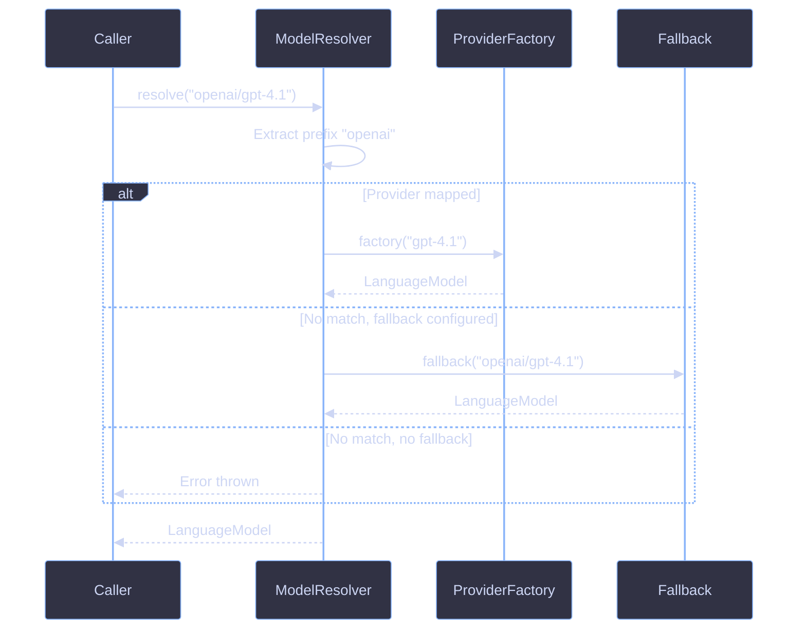

# Provider Resolution

Provider resolution maps model ID strings to AI SDK `LanguageModel` instances. `createModelResolver()` extracts the provider prefix from a model ID and dispatches to the appropriate provider factory.

## Architecture



## Key Concepts

### Resolution Algorithm

When `resolve("openai/gpt-4.1")` is called:

1. The model ID is validated (non-empty)
2. The prefix before the first `/` is extracted (`"openai"`)
3. If a provider factory is mapped for that prefix, it receives the model portion (`"gpt-4.1"`)
4. If no provider matches, the fallback receives the full ID (if configured)
5. If no fallback exists, an error is thrown

### Model IDs Without a Prefix

Model IDs without a `/` (e.g. `"gpt-4.1"`) skip provider lookup entirely and go directly to the fallback. If no fallback is configured, an error is thrown.

### ProviderFactory

A `ProviderFactory` is a function that takes a model name string and returns a `LanguageModel`. AI SDK provider constructors like `createOpenAI()` return compatible factories:

```ts
import { createOpenAI } from "@ai-sdk/openai";

const factory: ProviderFactory = createOpenAI({ apiKey: "..." });
const lm = factory("gpt-4.1");
```

### ProviderMap

A `ProviderMap` is a readonly record mapping prefix strings to `ProviderFactory` functions:

```ts
const providers: ProviderMap = {
  openai: createOpenAI({ apiKey: "..." }),
  anthropic: createAnthropic({ apiKey: "..." }),
};
```

## Usage

### Basic Resolver

```ts
const resolve = createModelResolver({
  providers: {
    openai: createOpenAI({ apiKey: process.env.OPENAI_API_KEY }),
  },
});

const lm = resolve("openai/gpt-4.1");
```

### Resolver with Fallback

```ts
const resolve = createModelResolver({
  providers: {
    openai: createOpenAI({ apiKey: process.env.OPENAI_API_KEY }),
  },
  fallback: openrouter,
});

const lm1 = resolve("openai/gpt-4.1");
const lm2 = resolve("anthropic/claude-sonnet-4");
```

`lm1` routes through the direct OpenAI provider. `lm2` has no mapped provider for `"anthropic"`, so it falls through to the OpenRouter fallback.

### Fallback-Only Resolver

```ts
const resolve = createModelResolver({
  fallback: openrouter,
});

const lm = resolve("openai/gpt-4.1");
```

All models route through OpenRouter regardless of prefix.

## References

- [Configuration](configuration.md)
- [OpenRouter](openrouter.md)
- [Model Catalog](../catalog/overview.md)
- [Setup Resolver Guide](../guides/setup-resolver.md)
