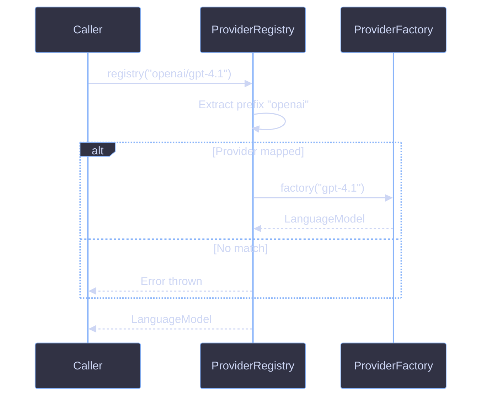

# Provider Resolution

Provider resolution maps model ID strings to AI SDK `LanguageModel` instances. `createProviderRegistry()` extracts the provider prefix from a model ID and dispatches to the appropriate provider factory.

## Architecture


```mermaid
%%{init: {
  'theme': 'base',
  'themeVariables': {
    'primaryColor': '#313244',
    'primaryTextColor': '#cdd6f4',
    'primaryBorderColor': '#6c7086',
    'lineColor': '#89b4fa',
    'secondaryColor': '#45475a',
    'tertiaryColor': '#1e1e2e',
    'actorBkg': '#313244',
    'actorBorder': '#89b4fa',
    'actorTextColor': '#cdd6f4',
    'signalColor': '#cdd6f4',
    'signalTextColor': '#cdd6f4'
  }
}}%%
sequenceDiagram
  participant C as Caller
  participant R as ProviderRegistry
  participant P as ProviderFactory

  C->>R: registry("openai/gpt-4.1")
  R->>R: Extract prefix "openai"

  alt Provider mapped
    R->>P: factory("gpt-4.1")
    P-->>R: LanguageModel
  else No match
    R-->>C: Error thrown
  end

  R-->>C: LanguageModel
```

## Key Concepts

### Resolution Algorithm

When `registry("openai/gpt-4.1")` is called:

1. The model ID is validated (non-empty)
2. The prefix before the first `/` is extracted (`"openai"`)
3. If a provider factory is mapped for that prefix, it receives the model portion (`"gpt-4.1"`)
4. If no provider matches, an error is thrown

### Model IDs Without a Prefix

Model IDs without a `/` (e.g. `"gpt-4.1"`) have no prefix to match, so an error is thrown. Always use the full `"provider/model"` format.

### ProviderFactory

A `ProviderFactory` is a function that takes a model name string and returns a `LanguageModel`. AI SDK provider constructors like `createOpenAI()` return compatible factories:

```ts
import { createOpenAI } from "@ai-sdk/openai";

const factory: ProviderFactory = createOpenAI({ apiKey: "..." });
const lm = factory("gpt-4.1");
```

### ProviderMap

A `ProviderMap` is a readonly record mapping prefix strings to `ProviderFactory` functions:

```ts
const providers: ProviderMap = {
  openai: createOpenAI({ apiKey: "..." }),
  anthropic: createAnthropic({ apiKey: "..." }),
};
```

## Usage

### Basic Registry

```ts
const registry = createProviderRegistry({
  providers: {
    openai: createOpenAI({ apiKey: process.env.OPENAI_API_KEY }),
  },
});

const lm = registry("openai/gpt-4.1");
```

### Multi-Provider Registry

```ts
import { createOpenAI } from "@ai-sdk/openai";
import { createAnthropic } from "@ai-sdk/anthropic";

const registry = createProviderRegistry({
  providers: {
    openai: createOpenAI({ apiKey: process.env.OPENAI_API_KEY }),
    anthropic: createAnthropic({ apiKey: process.env.ANTHROPIC_API_KEY }),
  },
});

const lm1 = registry("openai/gpt-4.1");
const lm2 = registry("anthropic/claude-sonnet-4");
```

`lm1` routes through `@ai-sdk/openai`. `lm2` routes through `@ai-sdk/anthropic`.

## References

- [Configuration](configuration.md)
- [OpenRouter](openrouter.md)
- [Model Catalog](../catalog/overview.md)
- [Setup Resolver Guide](../guides/setup-resolver.md)
