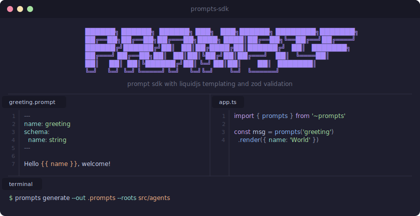

<p align="center">
  
</p>

# @pkg/prompts-sdk

Prompt SDK for authoring `.prompt` files with LiquidJS templating and Zod validation. The CLI generates typed TypeScript modules from `.prompt` sources so prompts are statically typed and validated at build time.

## Install

```bash
pnpm add @pkg/prompts-sdk --workspace
```

## `.prompt` File Format

A `.prompt` file is a Liquid template with YAML frontmatter:

```
---
name: coverage-assessor
group: agents/coverage-assessor
schema:
  scope:
    type: string
    description: Assessment scope
  target:
    type: string
    required: false
---

You are a coverage assessor for {{ scope }}.
Targeting {{ target }} docs.
```

| Field     | Required | Description                       |
| --------- | -------- | --------------------------------- |
| `name`    | Yes      | Unique kebab-case identifier      |
| `group`   | No       | Namespace path for grouping       |
| `version` | No       | Version number                    |
| `schema`  | No       | Variable declarations (see below) |

### Schema Variables

Each key under `schema` declares a template variable:

| Field         | Default  | Description                             |
| ------------- | -------- | --------------------------------------- |
| `type`        | `string` | Variable type (only `string` supported) |
| `required`    | `true`   | Whether the variable must be provided   |
| `description` | —        | Human-readable description              |

Shorthand: `scope: string` is equivalent to `scope: { type: string, required: true }`.

### Partials

Use `` to include shared partials. Partials are resolved from two locations (in order):

1. **Custom partials** — `.prompts/partials/` in your project (takes precedence)
2. **Built-in partials** — SDK's `src/prompts/` directory

All partials are flattened at codegen time — the generated output contains no render tags.

Built-in partials: `identity`, `constraints`, `tools`.

## `.prompts` Directory

The `.prompts` directory is your prompt workspace:

```
.prompts/
├── 📁 client/           # Generated (gitignored)
│   ├── 📄 index.ts
│   ├── 📄 chat-assistant.ts
│   └── 📄 coverage-assessor.ts
└── 📁 partials/         # Custom partials (committed)
    └── 📄 my-partial.prompt
```

| Subdirectory | Gitignored | Purpose                      |
| ------------ | ---------- | ---------------------------- |
| `client/`    | Yes        | Generated TypeScript modules |
| `partials/`  | No         | Custom reusable partials     |

## CLI

### `prompts generate`

Generate typed TypeScript modules from `.prompt` files.

```bash
prompts generate --out .prompts/client --roots prompts src/agents src/workflows
```

| Flag       | Alias | Required | Description                                         |
| ---------- | ----- | -------- | --------------------------------------------------- |
| `--out`    | `-o`  | Yes      | Output directory for generated files                |
| `--roots`  | `-r`  | Yes      | Directories to scan recursively for `.prompt` files |
| `--silent` | —     | No       | Suppress output except errors                       |

Custom partials are auto-discovered from the sibling `partials/` directory (relative to `--out`).

Runs lint validation automatically. Exits with code 1 on lint errors.

### `prompts lint`

Validate `.prompt` files without generating output.

```bash
prompts lint --roots prompts src/agents
```

| Flag         | Alias | Required | Description                                              |
| ------------ | ----- | -------- | -------------------------------------------------------- |
| `--roots`    | `-r`  | Yes      | Directories to scan                                      |
| `--partials` | `-p`  | No       | Custom partials directory (default: `.prompts/partials`) |
| `--silent`   | —     | No       | Suppress output except errors                            |

Reports:

- **Error** — template variable not declared in schema (undefined var)
- **Warn** — schema variable not used in template (unused var)

### `prompts create`

Scaffold a new `.prompt` file.

```bash
prompts create my-agent
prompts create my-agent --out src/agents/my-agent
```

| Arg/Flag    | Required | Description                                                   |
| ----------- | -------- | ------------------------------------------------------------- |
| `<name>`    | Yes      | Prompt name (kebab-case)                                      |
| `--out`     | No       | Output directory (defaults to cwd)                            |
| `--partial` | No       | Create as a partial in `.prompts/partials/` (ignores `--out`) |

### `prompts setup`

Interactive project configuration for `.prompt` file development.

```bash
prompts setup
```

Prompts to configure:

1. VSCode file association (`*.prompt` → Markdown)
2. VSCode Liquid extension recommendation
3. `.gitignore` entry for generated `.prompts/client/` directory
4. `tsconfig.json` path alias (`~prompts` → `./.prompts/client/index.ts`)

## Usage

### Consuming Prompts

Add the `~prompts` alias to your `tsconfig.json` (or run `prompts setup`):

```json
{
  "compilerOptions": {
    "paths": {
      "~prompts": ["./.prompts/client/index.ts"]
    }
  }
}
```

Import and use:

```typescript
import { prompts } from '~prompts'

// Render a prompt (validates variables via Zod)
const instructions = prompts('coverage-assessor').render({ scope: 'full' })

// Access the schema
const schema = prompts('coverage-assessor').schema

// Validate without rendering
const vars = prompts('coverage-assessor').validate({ scope: 'full' })
```

### Types

The generated registry exports `PromptName`, `Prompt<K>`, and the `prompts()` function:

```typescript
import { prompts, type Prompt, type PromptName } from '~prompts'

type CoveragePrompt = Prompt<'coverage-assessor'>
```

Prompts with no schema variables accept `render()` with no arguments.

### Package Script

Add to your `package.json`:

```json
{
  "scripts": {
    "prompts:generate": "prompts generate --out .prompts/client --roots prompts src/agents src/workflows"
  }
}
```

## Documentation

For comprehensive documentation, see [docs/overview.md](docs/overview.md).
