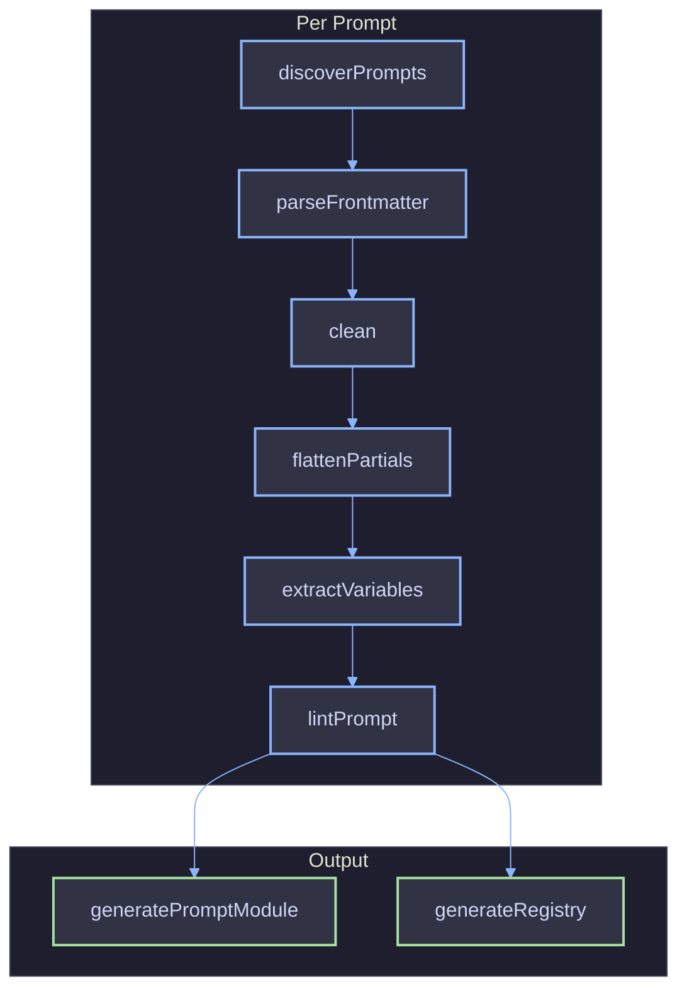

# Code Generation

The CLI transforms `.prompt` source files into typed TypeScript modules. This doc explains the pipeline stages and the shape of generated output.

## Pipeline

## Pipeline Stages

| Stage             | Input                        | Output                             | Description                                             |
| ----------------- | ---------------------------- | ---------------------------------- | ------------------------------------------------------- |
| Discover          | Root directories             | `DiscoveredPrompt[]`               | Scans for `.prompt` files (max depth 5)                 |
| Parse Frontmatter | Raw file content             | `{ name, group, version, schema }` | Extracts and validates YAML metadata                    |
| Clean             | Raw content                  | Template string                    | Strips frontmatter delimiters                           |
| Flatten Partials  | Template with `` | Resolved template                  | Inlines partial content with bound params               |
| Extract Variables | Template string              | `string[]`                         | Finds `{{ var }}`, ``, `` |
| Lint              | Schema + variables           | Diagnostics                        | Checks schema/template variable alignment               |

## Generated Output

### Per-Prompt Module (`<name>.ts`)

Each module exports a default object conforming to `PromptModule`:

| Member                | Type                     | Description                                      |
| --------------------- | ------------------------ | ------------------------------------------------ |
| `name`                | `string` (const)         | Prompt name from frontmatter                     |
| `group`               | `string \| undefined`    | Optional grouping key                            |
| `schema`              | `ZodObject`              | Zod schema built from frontmatter `schema` block |
| `render(variables)`   | `(Variables) => string`  | Validates input then renders via LiquidJS        |
| `validate(variables)` | `(unknown) => Variables` | Zod parse only                                   |

### Registry (`index.ts`)

Aggregates all per-prompt modules into a single entry point:

| Export          | Type                  | Description                                     |
| --------------- | --------------------- | ----------------------------------------------- |
| `prompts(name)` | `<K>(K) => Prompt<K>` | Typed accessor backed by `createPromptRegistry` |
| `PromptName`    | Union type            | All registered prompt names                     |
| `Prompt<K>`     | Generic type          | Module type for a given prompt name             |

## Output Directory

Generated files go to the `--out` directory (conventionally `.prompts/client/`). This subdirectory should be gitignored. The parent `.prompts/` directory also holds `partials/` for custom partials (committed to git). Import generated code via the `~prompts` tsconfig alias.

## References

- [File Format](../file-format/overview.md)
- [Library API](../library/overview.md)
- [CLI Commands](../cli/commands.md)
