# Prompts SDK Overview

Prompt authoring SDK with two surfaces: a **CLI** for build-time code generation from `.prompt` files, and a **library** for runtime template rendering with full type safety.

## Architecture

```mermaid
%%{init: {
  'theme': 'base',
  'themeVariables': {
    'primaryColor': '#313244',
    'primaryTextColor': '#cdd6f4',
    'primaryBorderColor': '#6c7086',
    'lineColor': '#89b4fa',
    'secondaryColor': '#45475a',
    'tertiaryColor': '#1e1e2e',
    'background': '#1e1e2e',
    'mainBkg': '#313244',
    'clusterBkg': '#1e1e2e',
    'clusterBorder': '#45475a'
  },
  'flowchart': { 'curve': 'basis', 'padding': 15 }
}}%%
flowchart LR
  P[".prompt files"]:::external

  subgraph CLI ["CLI (Build Time)"]
    direction LR
    D[Discover] --> PA[Parse] --> L[Lint] --> F[Flatten] --> C[Codegen]
  end

  subgraph RT ["Runtime"]
    direction LR
    E[Engine] --> R[Registry]
  end

  P --> D
  C --> G["Generated .prompts/client/*.ts"]:::agent
  G --> E
  R --> O["Rendered string"]:::agent

  class D,PA,L,F,C core
  class E,R gateway

  style CLI fill:none,stroke:#89b4fa,stroke-width:2px,stroke-dasharray:5 5
  style RT fill:none,stroke:#fab387,stroke-width:2px,stroke-dasharray:5 5

  classDef external fill:#313244,stroke:#f5c2e7,stroke-width:2px,color:#cdd6f4
  classDef core fill:#313244,stroke:#89b4fa,stroke-width:2px,color:#cdd6f4
  classDef agent fill:#313244,stroke:#a6e3a1,stroke-width:2px,color:#cdd6f4
  classDef gateway fill:#313244,stroke:#fab387,stroke-width:2px,color:#cdd6f4
```



## Package Structure

```
📁 packages/prompts-sdk/
├── 📁 src/
│   ├── 📁 cli/
│   │   ├── 📁 commands/       # generate, lint, create, setup
│   │   └── 📁 lib/            # codegen, frontmatter, flatten, lint, paths
│   ├── 📁 prompts/            # Built-in partials (identity, constraints, tools)
│   ├── 📄 engine.ts           # LiquidJS engine factory
│   ├── 📄 registry.ts         # Typed prompt registry
│   ├── 📄 clean.ts            # Frontmatter stripping pipeline
│   ├── 📄 types.ts            # PromptModule, PromptRegistry interfaces
│   └── 📄 index.ts            # Public exports
└── 📁 docs/
```

## Dual Surface

| Surface | When       | What                                                                         |
| ------- | ---------- | ---------------------------------------------------------------------------- |
| CLI     | Build time | Discovers `.prompt` files, validates frontmatter, generates typed TS modules |
| Library | Runtime    | LiquidJS engine renders templates, registry provides typed access            |

## Quick Start

1. Create a `.prompt` file with YAML frontmatter and a LiquidJS template body.
2. Run `prompts generate --out .prompts/client --roots src/agents` to produce typed modules.
3. Import from the `~prompts` alias in your application code.
4. Call `.render({ vars })` with full type safety derived from the Zod schema in frontmatter.

## References

- [File Format](file-format/overview.md)
- [Frontmatter](file-format/frontmatter.md)
- [Partials](file-format/partials.md)
- [CLI](cli/overview.md)
- [CLI Commands](cli/commands.md)
- [Code Generation](codegen/overview.md)
- [Library API](library/overview.md)
- [Guide: Author a Prompt](guides/author-prompt.md)
- [Guide: Setup Project](guides/setup-project.md)
- [Guide: Add a Partial](guides/add-partial.md)
- [Troubleshooting](troubleshooting.md)
