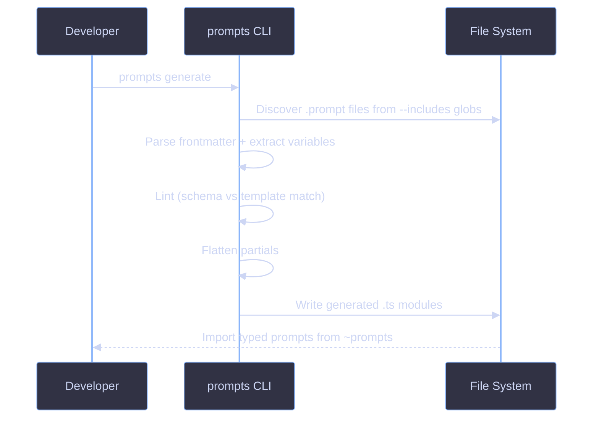

# CLI

The `prompts` CLI discovers, validates, and generates typed TypeScript from `.prompt` files.

## Installation

Available as the `prompts` binary from `@funkai/cli`. Install it as a workspace dependency:

```bash
pnpm add @funkai/cli --workspace
```

## Workflow



## Commands Reference

### `prompts generate`

Generate typed TypeScript modules from `.prompt` files.

**Alias:** `gen`

| Flag         | Required | Description                               |
| ------------ | -------- | ----------------------------------------- |
| `--out`      | Yes      | Output directory for generated files      |
| `--includes` | Yes      | Glob patterns to scan for `.prompt` files |
| `--partials` | No       | Custom partials directory                 |
| `--silent`   | No       | Suppress output except errors             |

```bash
prompts generate --out .prompts/client --includes "prompts/**" "src/agents/**" "src/workflows/**"
```

Custom partials are auto-discovered from the sibling `partials/` directory (relative to `--out`).

Runs lint validation automatically before generating. Exits with code 1 on lint errors.

### `prompts lint`

Validate `.prompt` files without generating output.

| Flag         | Required | Description                                              |
| ------------ | -------- | -------------------------------------------------------- |
| `--includes` | Yes      | Glob patterns to scan for `.prompt` files                |
| `--partials` | No       | Custom partials directory (default: `.prompts/partials`) |
| `--silent`   | No       | Suppress output except errors                            |

**Diagnostics:**

| Level | Meaning                                  |
| ----- | ---------------------------------------- |
| Error | Template variable not declared in schema |
| Warn  | Schema variable not used in template     |

```bash
prompts lint --includes "prompts/**" "src/agents/**"
```

### `prompts create`

Scaffold a new `.prompt` file.

| Arg/Flag    | Required | Description                                                   |
| ----------- | -------- | ------------------------------------------------------------- |
| `<name>`    | Yes      | Prompt name (kebab-case)                                      |
| `--out`     | No       | Output directory (defaults to cwd)                            |
| `--partial` | No       | Create as a partial in `.prompts/partials/` (ignores `--out`) |

```bash
prompts create coverage-assessor --out src/agents/coverage-assessor
prompts create summary --partial
```

### `prompts setup`

Interactive project configuration for `.prompt` development. No flags -- fully interactive.

Configures:

1. VSCode file association (`*.prompt` -> Markdown)
2. VSCode Liquid extension recommendation
3. `.gitignore` entry for generated `.prompts/client/` directory
4. `tsconfig.json` path alias (`~prompts` -> `./.prompts/client/index.ts`)

## Configuration

Instead of passing flags on every invocation, you can define defaults in a `funkai.config.ts` file at your project root. CLI flags always take precedence over config values.

```ts
import { defineConfig } from "@funkai/config";

export default defineConfig({
  prompts: {
    out: ".prompts/client",
    includes: ["src/prompts/**", "src/agents/**"],
    excludes: ["**/*.partial.prompt"],
    partials: ".prompts/partials",
    groups: [
      {
        name: "agents/core",
        includes: ["src/prompts/agents/core/**"],
        excludes: ["src/prompts/agents/core/internal/**"],
      },
    ],
  },
});
```

### Config Fields

| Field      | Type                | Description                                                                                                        |
| ---------- | ------------------- | ------------------------------------------------------------------------------------------------------------------ |
| `out`      | `string`            | Output directory for generated prompt modules. Same as `--out`.                                                    |
| `includes` | `string[]`          | Glob patterns to scan for `.prompt` files (defaults to `["./**"]`). Same as `--includes`.                          |
| `excludes` | `string[]`          | Glob patterns to exclude from discovery.                                                                           |
| `partials` | `string`            | Custom partials directory. Same as `--partials`.                                                                   |
| `groups`   | `PromptGroup[]`     | Pattern-based group assignments. Prompts matched by a group's `includes` (and not its `excludes`) get the group's `name` assigned unless frontmatter already defines a `group`. |

### Group Schema

Each entry in `groups` has:

| Field      | Required | Type       | Description                                   |
| ---------- | -------- | ---------- | --------------------------------------------- |
| `name`     | Yes      | `string`   | Group path (e.g. `"agents/core"`)             |
| `includes` | Yes      | `string[]` | Glob patterns to match prompt file paths      |
| `excludes` | No       | `string[]` | Glob patterns to exclude from this group      |

### Precedence

CLI flags override config values. For example, `prompts generate --out dist` uses `dist` even if `funkai.config.ts` sets `out: ".prompts/client"`. When neither a CLI flag nor a config value is provided, defaults apply (`includes` defaults to `["./**"]`).

## Integration

Add a generate script to your `package.json`:

```json
{
  "scripts": {
    "prompts:generate": "prompts generate --out .prompts/client --includes \"prompts/**\" \"src/agents/**\""
  }
}
```

## References

- [File Format](file-format.md)
- [Code Generation & Library](codegen.md)
- [Setup](setup.md)
- [Troubleshooting](troubleshooting.md)
