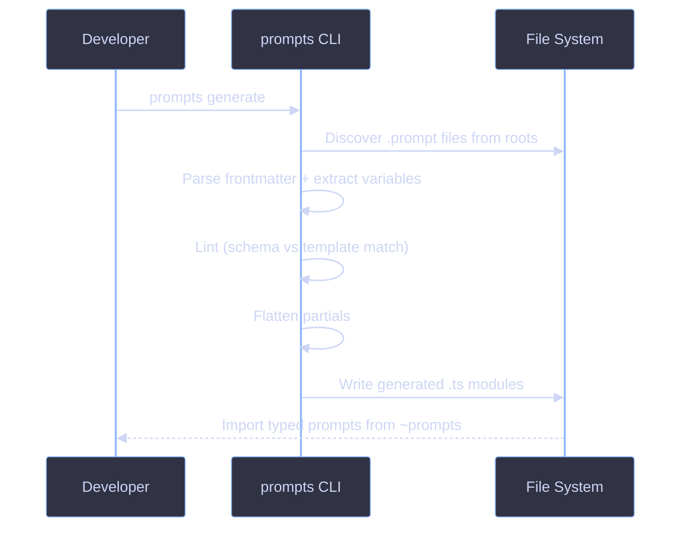

# CLI Overview

The `prompts` CLI discovers, validates, and generates typed TypeScript from `.prompt` files.

## Installation

Available as the `prompts` binary from `@funkai/cli`. Install it as a workspace dependency:

```bash
pnpm add @funkai/cli --workspace
```

## Workflow



## Commands

| Command            | Alias | Description                                    |
| ------------------ | ----- | ---------------------------------------------- |
| `prompts generate` | `gen` | Generate typed TS modules from `.prompt` files |
| `prompts lint`     | ---   | Validate `.prompt` files without generating    |
| `prompts create`   | ---   | Scaffold a new `.prompt` file                  |
| `prompts setup`    | ---   | Interactive project configuration              |

See the [Commands Reference](commands.md) for flags, examples, and diagnostics.

## Integration

Add a generate script to your `package.json`:

```json
{
  "scripts": {
    "prompts:generate": "prompts generate --out .prompts/client --roots prompts src/agents"
  }
}
```

## References

- [Commands Reference](commands.md)
- [Code Generation](../codegen/overview.md)
- [Setup Guide](../guides/setup-project.md)
