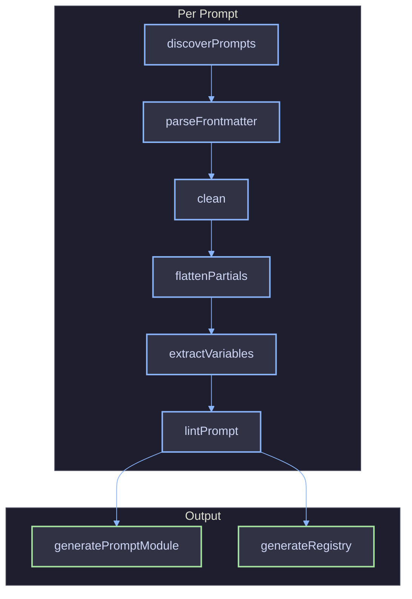

# Code Generation & Library

The CLI transforms `.prompt` source files into typed TypeScript modules. This doc covers the pipeline stages, generated output shape, and the runtime library API.

## Pipeline



## Pipeline Stages

| Stage             | Input                        | Output                             | Description                                             |
| ----------------- | ---------------------------- | ---------------------------------- | ------------------------------------------------------- |
| Discover          | Root directories             | `DiscoveredPrompt[]`               | Scans for `.prompt` files (max depth 5)                 |
| Parse Frontmatter | Raw file content             | `{ name, group, version, schema }` | Extracts and validates YAML metadata                    |
| Clean             | Raw content                  | Template string                    | Strips frontmatter delimiters                           |
| Flatten Partials  | Template with `` | Resolved template                  | Inlines partial content with bound params               |
| Extract Variables | Template string              | `string[]`                         | Finds `{{ var }}`, ``, `` |
| Lint              | Schema + variables           | Diagnostics                        | Checks schema/template variable alignment               |

## Generated Output

### Per-Prompt Module (`<name>.ts`)

Each module exports a default object conforming to `PromptModule`:

| Member                | Type                     | Description                                      |
| --------------------- | ------------------------ | ------------------------------------------------ |
| `name`                | `string` (const)         | Prompt name from frontmatter                     |
| `group`               | `string \| undefined`    | Optional grouping key                            |
| `schema`              | `ZodObject`              | Zod schema built from frontmatter `schema` block |
| `render(variables)`   | `(Variables) => string`  | Validates input then renders via LiquidJS        |
| `validate(variables)` | `(unknown) => Variables` | Zod parse only                                   |

### Registry (`index.ts`)

Aggregates all per-prompt modules into a single entry point:

| Export    | Type                  | Description                                                                                            |
| --------- | --------------------- | ------------------------------------------------------------------------------------------------------ |
| `prompts` | `PromptRegistry<...>` | Deep-frozen const object with dot-access, nested by group. Use `typeof prompts` for type-level access. |

## Output Directory

Generated files go to the `--out` directory (conventionally `.prompts/client/`). This subdirectory should be gitignored. The parent `.prompts/` directory also holds `partials/` for custom partials (committed to git). Import generated code via the `~prompts` tsconfig alias.

## Runtime Library API

The library surface provides the runtime engine and registry used by generated code and consuming packages.

### Exports

| Export                 | Type                                | Entry Point | Description                                                                |
| ---------------------- | ----------------------------------- | ----------- | -------------------------------------------------------------------------- |
| `liquidEngine`         | `Liquid`                            | `@funkai/prompts/runtime` | Internal shared LiquidJS instance (not re-exported from main entry point) |
| `createEngine`         | `(partialsDir, options?) => Liquid` | CLI         | Factory for filesystem-backed engines (used by CLI for partial resolution) |
| `clean`                | `(content: string) => string`       | CLI         | Strips frontmatter, returns render-ready template                          |
| `createPromptRegistry` | `(modules) => PromptRegistry`       | Main        | Creates typed registry from prompt module map                              |
| `createPrompt`         | `(config) => PromptModule`          | Main        | Creates a prompt module from a config object                               |
| `createPromptGroup`    | `(name) => ...`                     | Main        | Creates a prompt group helper                                              |

### Engine

The shared `engine` instance is configured with `ownPropertyOnly: true`, `strictFilters: true`, and `strictVariables: true` for security. No filesystem access -- templates are rendered from strings via `parseAndRenderSync`.

`createEngine` accepts a `partialsDir` and optional overrides. It enables filesystem-backed partial resolution (`.prompt` extension, caching enabled) for use during codegen flattening. The safety defaults `strictFilters`, `strictVariables`, and `ownPropertyOnly` are always enforced and cannot be overridden via `CreateEngineOptions`.

### Registry

`createPromptRegistry` accepts a (possibly nested) record of `PromptModule` objects and namespace nodes. It returns a deep-frozen `PromptRegistry` with direct property access:

```ts
const prompts = createPromptRegistry({
  agents: { coverageAssessor },
  greeting,
});
prompts.agents.coverageAssessor.render({ scope: "full" });
prompts.greeting.render();
```

Nesting is driven by the `group` field in frontmatter. Each `/`-separated segment becomes a nesting level, with all names converted to camelCase. The registry is frozen at creation time to prevent mutation.

## Consumer Import Pattern

The generated `index.ts` calls `createPromptRegistry` with all prompt modules organized by group and exports a `prompts` const object. Consumers import via the `~prompts` tsconfig alias:

```ts
import { prompts } from "~prompts";

// Flat (no group)
const text = prompts.greeting.render();

// Nested (group: agents)
const text = prompts.agents.coverageAssessor.render({ scope: "full" });
```

Types are inferred from the object structure, giving full type safety on `render` and `validate` arguments at every nesting level.

## Types Reference

| Type                  | Description                                                                                                               |
| --------------------- | ------------------------------------------------------------------------------------------------------------------------- |
| `PromptModule`        | Interface: `name`, `group`, `schema` (ZodType), `render(vars)`, `validate(vars)`                                          |
| `PromptNamespace`     | A nested namespace node -- values are `PromptModule` leaves or further nested namespaces                                  |
| `PromptRegistry`      | Deep-readonly mapped type over a `PromptNamespace` tree                                                                   |
| `CreateEngineOptions` | Options for `createEngine`: `root`, `partials`, `extname`, `cache`, `strictVariables`. Safety defaults (`strictFilters`, `strictVariables`, `ownPropertyOnly`) are always enforced and cannot be overridden. |
| `Liquid`              | Re-exported LiquidJS engine type                                                                                          |

## References

- [File Format](file-format.md)
- [CLI](cli.md)
