# Runtime Prompt Construction API

Factory functions for building prompt modules, groups, and registries at runtime -- without the CLI codegen pipeline. Useful when prompts are defined dynamically, loaded from a database, or assembled programmatically.

## Overview

```mermaid
%%{init: {
  'theme': 'base',
  'themeVariables': {
    'primaryColor': '#313244',
    'primaryTextColor': '#cdd6f4',
    'primaryBorderColor': '#6c7086',
    'lineColor': '#89b4fa',
    'secondaryColor': '#45475a',
    'tertiaryColor': '#1e1e2e',
    'background': '#1e1e2e',
    'mainBkg': '#313244',
    'clusterBkg': '#1e1e2e',
    'clusterBorder': '#45475a'
  },
  'flowchart': { 'curve': 'basis', 'padding': 15 }
}}%%
flowchart LR
  classDef core fill:#313244,stroke:#89b4fa,stroke-width:2px,color:#cdd6f4
  classDef agent fill:#313244,stroke:#a6e3a1,stroke-width:2px,color:#cdd6f4
  classDef gateway fill:#313244,stroke:#fab387,stroke-width:2px,color:#cdd6f4

  A["createPrompt()"]:::core
  B["createPromptGroup()"]:::agent
  C["createPromptRegistry()"]:::gateway
  D["Rendered string"]:::gateway

  A -->|"PromptModule"| B
  B -->|"Grouped modules"| C
  C -->|"Frozen registry"| D

  A -->|"standalone"| D
```



The three functions compose in a natural pipeline: **create** individual prompt modules, optionally **group** them into namespaces, then **register** the tree into a frozen, typed registry for consumption.

## `createPrompt()`

Factory function that produces a `PromptModule` from a configuration object. Encapsulates LiquidJS template rendering and Zod schema validation into a single module.

### Signature

```ts
function createPrompt<T>(config: PromptConfig<T>): PromptModule<T>;
```

### Parameters

| Parameter | Type              | Description                                                  |
| --------- | ----------------- | ------------------------------------------------------------ |
| `config`  | `PromptConfig<T>` | Prompt configuration with name, template, schema, and group. |

#### `PromptConfig<T>`

| Field      | Type         | Required | Description                                                       |
| ---------- | ------------ | -------- | ----------------------------------------------------------------- |
| `name`     | `string`     | Yes      | Kebab-case prompt identifier (e.g. `'greeting'`, `'worker-system'`). |
| `template` | `string`     | Yes      | LiquidJS template string with `{{ variable }}` expressions.       |
| `schema`   | `ZodType<T>` | Yes      | Zod schema for validating template variables.                     |
| `group`    | `string`     | No       | Optional group path (e.g. `'agents'`, `'agents/core'`).          |

### Returns

A `PromptModule<T>` with the following members:

| Member                | Type                     | Description                                      |
| --------------------- | ------------------------ | ------------------------------------------------ |
| `name`                | `string`                 | Prompt name from config.                         |
| `group`               | `string \| undefined`    | Optional group path.                             |
| `schema`              | `ZodType<T>`             | Zod schema for variable validation.              |
| `render(variables)`   | `(T) => string`          | Validates input via Zod then renders via LiquidJS. Throws `ZodError` on invalid input. |
| `validate(variables)` | `(unknown) => T`         | Zod parse only. Throws `ZodError` on failure.    |

### Example

```ts
import { createPrompt } from "@funkai/prompts";
import { z } from "zod";

const greeting = createPrompt({
  name: "greeting",
  template: "Hello {{ name }}, welcome to {{ place }}!",
  schema: z.object({ name: z.string(), place: z.string() }),
});

greeting.render({ name: "Alice", place: "Wonderland" });
// => "Hello Alice, welcome to Wonderland!"

greeting.validate({ name: "Alice", place: "Wonderland" });
// => { name: "Alice", place: "Wonderland" }
```

## `createPromptGroup()`

Groups a record of prompt modules under a shared namespace by setting the `group` field on each module. Returns a new object without mutating the originals.

### Signature

```ts
function createPromptGroup<T extends Record<string, PromptModule>>(
  name: string,
  prompts: T,
): T;
```

### Parameters

| Parameter | Type                              | Description                                                          |
| --------- | --------------------------------- | -------------------------------------------------------------------- |
| `name`    | `string`                          | Group name applied to each prompt (e.g. `'agents'`, `'agents/core'`). |
| `prompts` | `Record<string, PromptModule>`    | Record of prompt modules to group.                                   |

### Returns

A new record of `PromptModule` objects with the `group` field set to `name`. The return type preserves the input record shape for full type inference.

### Example

```ts
import { createPrompt, createPromptGroup } from "@funkai/prompts";
import { z } from "zod";

const greeting = createPrompt({
  name: "greeting",
  template: "Hello {{ name }}!",
  schema: z.object({ name: z.string() }),
});

const farewell = createPrompt({
  name: "farewell",
  template: "Goodbye {{ name }}, see you {{ when }}.",
  schema: z.object({ name: z.string(), when: z.string() }),
});

const social = createPromptGroup("social", { greeting, farewell });

social.greeting.render({ name: "Alice" });
// => "Hello Alice!"

social.farewell.group;
// => "social"
```

## `createPromptRegistry()`

Creates a typed, deep-frozen registry from a (possibly nested) map of prompt modules and namespace nodes. The registry provides direct property access with full type safety at every nesting level.

### Signature

```ts
function createPromptRegistry<T extends PromptNamespace>(
  modules: T,
): PromptRegistry<T>;
```

### Parameters

| Parameter | Type              | Description                                                               |
| --------- | ----------------- | ------------------------------------------------------------------------- |
| `modules` | `PromptNamespace` | Record mapping prompt names (or group namespaces) to their modules.       |

### Returns

A `PromptRegistry<T>` -- a deep-frozen, deep-readonly mapped type with direct property access. Namespace nodes are recursively frozen; `PromptModule` leaves are left unfrozen to avoid breaking Zod internal state.

### Example

```ts
import {
  createPrompt,
  createPromptGroup,
  createPromptRegistry,
} from "@funkai/prompts";
import { z } from "zod";

const greeting = createPrompt({
  name: "greeting",
  template: "Hello {{ name }}!",
  schema: z.object({ name: z.string() }),
});

const agents = createPromptGroup("agents", {
  coverageAssessor: createPrompt({
    name: "coverage-assessor",
    template: "Assess coverage for scope: {{ scope }}.",
    schema: z.object({ scope: z.string() }),
  }),
});

const prompts = createPromptRegistry({ greeting, agents });

prompts.greeting.render({ name: "Alice" });
// => "Hello Alice!"

prompts.agents.coverageAssessor.render({ scope: "full" });
// => "Assess coverage for scope: full."
```

## Composition Flow

The three functions are designed to compose together, but each is useful on its own:

| Use Case                          | Functions Needed                                           |
| --------------------------------- | ---------------------------------------------------------- |
| Single ad-hoc prompt              | `createPrompt()`                                           |
| Logically grouped prompts         | `createPrompt()` + `createPromptGroup()`                   |
| Full typed registry (recommended) | `createPrompt()` + `createPromptGroup()` + `createPromptRegistry()` |

For the full registry flow, the pattern is:

1. **Create** individual prompt modules with `createPrompt()`.
2. **Group** related modules under namespace keys with `createPromptGroup()`.
3. **Register** the tree with `createPromptRegistry()` to get a frozen, typed entry point.

This mirrors the codegen pipeline output -- the CLI generates the same structure automatically from `.prompt` files.

## Types Reference

| Type              | Description                                                                  |
| ----------------- | ---------------------------------------------------------------------------- |
| `PromptConfig<T>` | Configuration input for `createPrompt()`.                                    |
| `PromptModule<T>` | A prompt module with `render`, `validate`, `name`, `group`, and `schema`.    |
| `PromptNamespace`  | A nested namespace node -- values are `PromptModule` leaves or further namespaces. |
| `PromptRegistry<T>` | Deep-readonly mapped type over a `PromptNamespace` tree.                   |

## References

- [Library API Overview](overview.md)
- [Code Generation & Library](../codegen.md)
- [File Format](../file-format.md)
